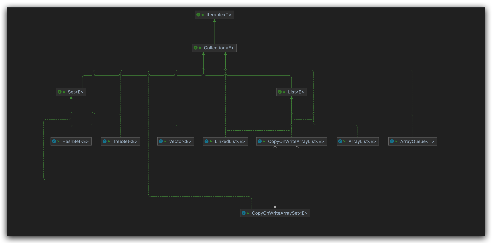
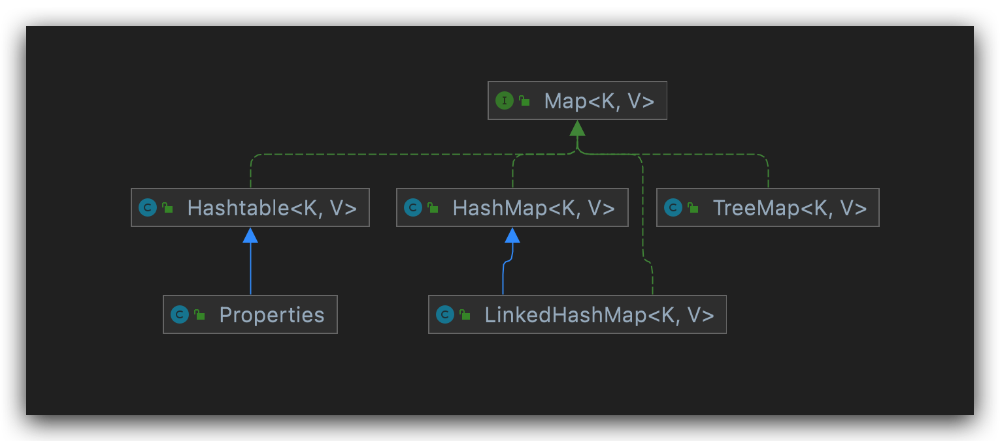
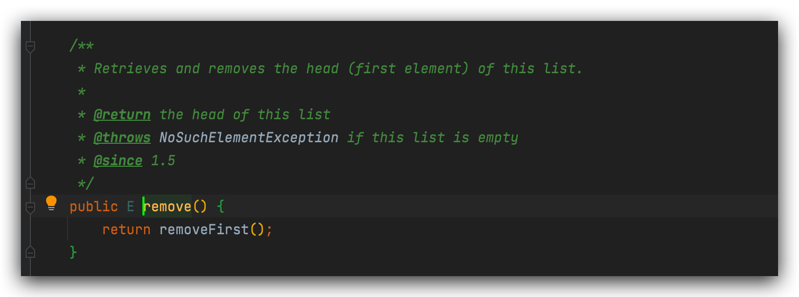
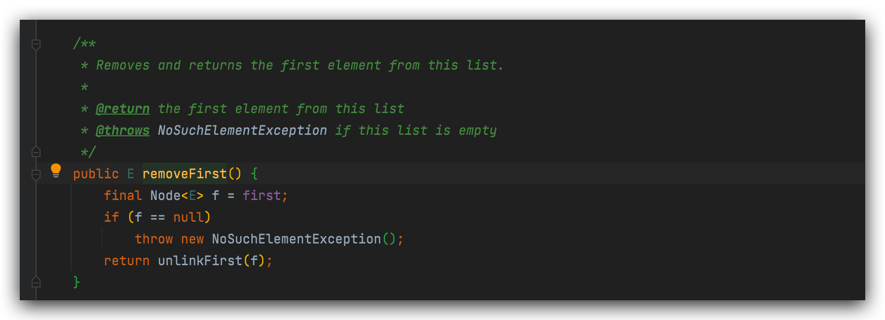
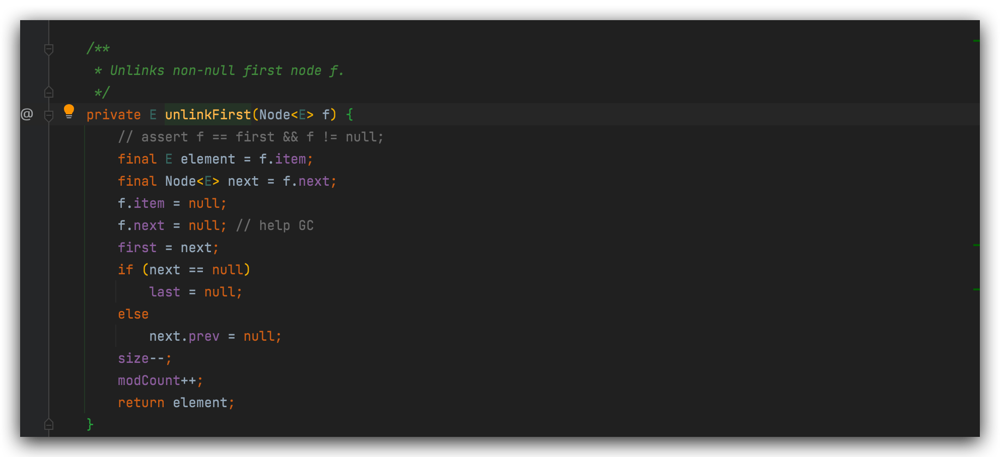
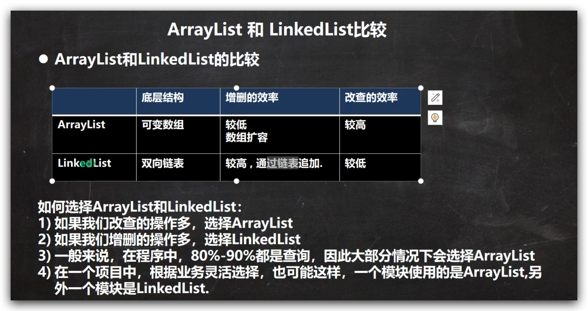

# 集合继承关系和框架概览

# 单列集合
##List
首先介绍List常用方法

所有实现了list接口的类都可以调用上面这些方法, 也就是说将:`List list = new ArrayList<String>();` 的等号右边的实现子类替换为任何其他实现了List接口的类(如: new LinkedList<String>())都可以调用下面的方法.

## List实现子类

### ArrayList
### Vector
#### 特点
1. Vector底层也是数组实现.
2. Vector是线程安全的, 其方法上都加了synchronized关键字.
3. 生产环境, 如果要确保线程安全, 考虑使用vector.
4. Vector的扩容机制和ArrayList类似, 无参构造会首次设capacity为10,有参构造则设为指定大小, 然后之后每次扩容为2倍. (注意⚠️: 倍数值与ArrayList的1.5倍不一样.)
### LinkedList
1. 底层实现是双向链表
2. 因为是双向链表,添加删除元素效率很高
3. 是 

remove原理解析:

总结: 
如何根据业务场景选择对应的List接口的实现子类?

值得注意的是ArrayList和LinkedList都是线程不安全的.

## Set实现子类
Set具有如下特点:
1. 不允许有重复元素
2. 存入和取出顺序不保证一致
3. 可以存null, 但是由于第2点, 最多只能一个null. 
4. 没有索引, 所以没法根据索引取元素.
5. 底层实现是hashmap