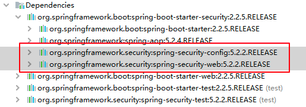
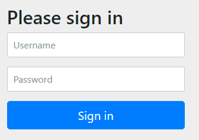
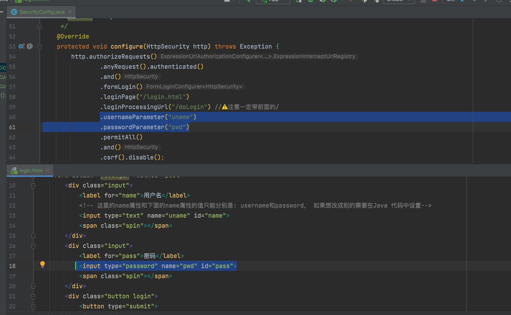
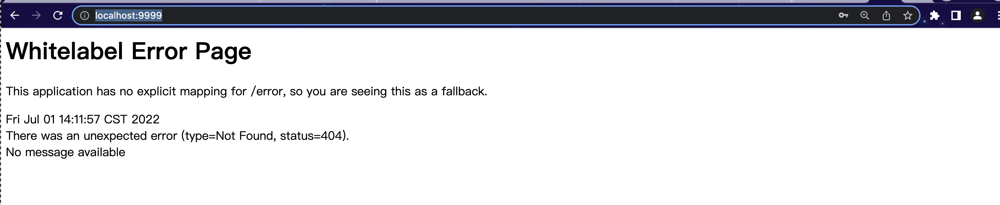
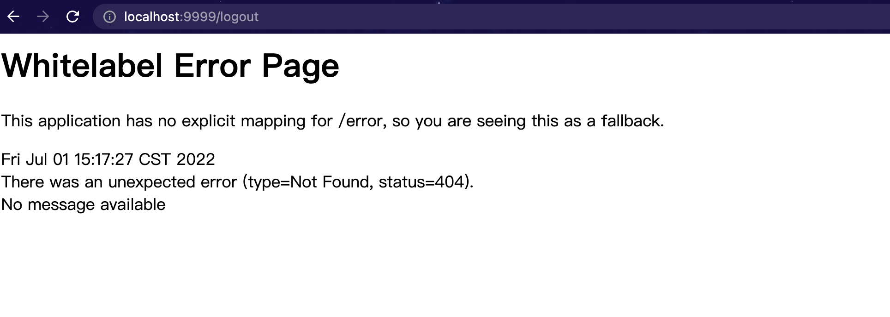
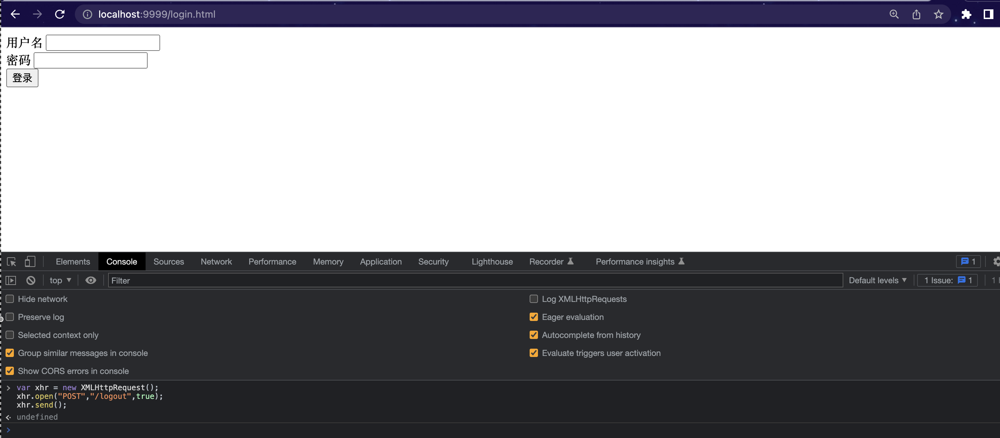
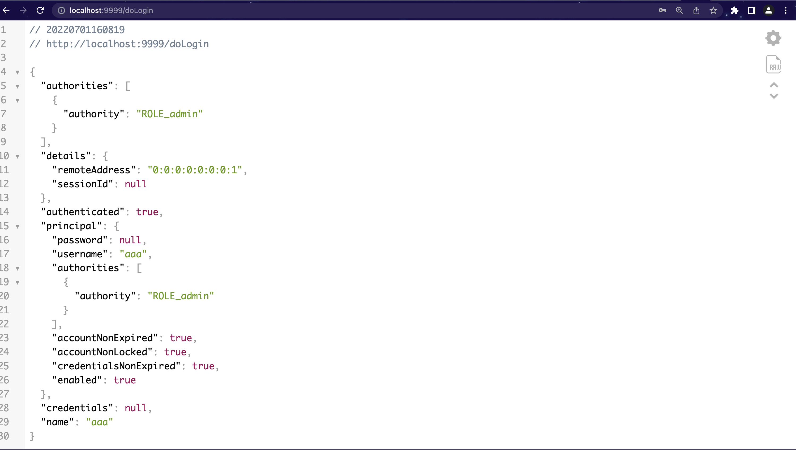

新建项目并添加依赖 pom.xml：
```xml
<?xml version="1.0" encoding="UTF-8"?>

<project xmlns="http://maven.apache.org/POM/4.0.0" xmlns:xsi="http://www.w3.org/2001/XMLSchema-instance"
  xsi:schemaLocation="http://maven.apache.org/POM/4.0.0 http://maven.apache.org/xsd/maven-4.0.0.xsd">
  <modelVersion>4.0.0</modelVersion>

  <parent>
    <artifactId>spring-boot-starter-parent</artifactId>
    <groupId>org.springframework.boot</groupId>
    <version>2.2.5.RELEASE</version>
    <relativePath/>
  </parent>

  <groupId>org.example</groupId>
  <artifactId>MySpringSecurity</artifactId>
  <version>1.0-SNAPSHOT</version>

  <name>MySpringSecurity</name>

  <properties>
    <project.build.sourceEncoding>UTF-8</project.build.sourceEncoding>
    <maven.compiler.source>1.8</maven.compiler.source>
    <maven.compiler.target>1.8</maven.compiler.target>
  </properties>

  <dependencies>
    <dependency>
      <groupId>org.springframework.boot</groupId>
      <artifactId>spring-boot-starter-web</artifactId>
    </dependency>
    <dependency>
      <groupId>org.springframework.boot</groupId>
      <artifactId>spring-boot-starter-security</artifactId>
    </dependency>
    <dependency>
      <groupId>org.springframework.boot</groupId>
      <artifactId>spring-boot-starter-test</artifactId>
      <scope>test</scope>
      <exclusions>
        <exclusion>
          <groupId>org.junit.vintage</groupId>
          <artifactId>junit-vintage-engine</artifactId>
        </exclusion>
      </exclusions>
    </dependency>
  </dependencies>

</project>
```


新建Controller
```java
package org.example.controller;

import org.springframework.web.bind.annotation.RequestMapping;
import org.springframework.web.bind.annotation.RestController;

/**
 * @author Joshua.H.Brooks
 * @description
 * @date 2022-07-01 01:22
 */
@RestController
public class HiController {
    @RequestMapping(value = "/hi")
    public String hi(){
        return "hi spring security";
    }
}
```
启动主启动类:
```java
package org.example;

import org.springframework.boot.SpringApplication;
import org.springframework.boot.autoconfigure.SpringBootApplication;

@SpringBootApplication
public class App 
{
    public static void main( String[] args )
    {
        SpringApplication.run(App.class,args);
    }
}
```
在启动日志中可以看见一行输出：<br/>
`Using generated security password: f79e5558-9195-440d-8770-070c2b0ee5a0`<br/>
由此可以看出,只要引入了spring security的包， 就会对所有访问进行保护。
访问: `http://localhost:9999/hi` 可以看见页面跳转到了 `http://localhost:9999/login`. 如下：
用 user / f79e5558-9195-440d-8770-070c2b0ee5a0 就可以登陆访问到了。

分析源码：
```java
package org.springframework.boot.autoconfigure.security.servlet;

@ConditionalOnClass({AuthenticationManager.class})
@ConditionalOnBean({ObjectPostProcessor.class})
@ConditionalOnMissingBean(
        value = {AuthenticationManager.class, AuthenticationProvider.class, UserDetailsService.class},
        type = {"org.springframework.security.oauth2.jwt.JwtDecoder", "org.springframework.security.oauth2.server.resource.introspection.OpaqueTokenIntrospector"}
)
//其他代码...
public class UserDetailsServiceAutoConfiguration {
    private String getOrDeducePassword(User user, PasswordEncoder encoder) {
        String password = user.getPassword();
        if (user.isPasswordGenerated()) {
            logger.info(String.format("%n%nUsing generated security password: %s%n", user.getPassword()));
        }

        return encoder == null && !PASSWORD_ALGORITHM_PATTERN.matcher(password).matches() ? "{noop}" + password : password;
    }
}
```
之所以会使用是因为

如果想要自定义用户密码可以在yml文件中配置：
```yaml
server:
  port: 9999
spring:
  security:
    user:
      name: Joshua
      password: 123456
```
然后重启发现登陆时输入原来的用户。
然后启动既可以用 `Joshua / 123456`  登陆了。

当然也可以通过Java代码进行用户的配置
```java
package org.example.config;

import org.springframework.context.annotation.Bean;
import org.springframework.context.annotation.Configuration;
import org.springframework.security.config.annotation.authentication.builders.AuthenticationManagerBuilder;
import org.springframework.security.config.annotation.web.configuration.WebSecurityConfigurerAdapter;
import org.springframework.security.crypto.password.NoOpPasswordEncoder;
import org.springframework.security.crypto.password.PasswordEncoder;

/**
 * @author Joshua.H.Brooks
 * @description Spring-Security V5 之后强制密码必须加密
 * @date 2022-07-01 12:15
 */
@Configuration
public class SecurityConfig extends WebSecurityConfigurerAdapter {
    @Bean
    PasswordEncoder passwordEncoder() {
        //TODO 后期改成加密的
        return NoOpPasswordEncoder.getInstance(); //不对密码进行加密， 暂时这样
    }

    @Override
    protected void configure(AuthenticationManagerBuilder auth) throws Exception {
        auth.inMemoryAuthentication()
                .withUser("aaa")
                .password("111")
                .roles("admin")
                .and()
                .withUser("bbb")
                .password("222")
                .roles("admin");
    }
}
```
重启后发现用 `aaa / 111 和 bbb / 222`都可以登陆。


3.自定义表单登录页
默认的表单登录有点简陋 很多时候我们需要对登录页面进行改造，那我们可以自定义一个登录页面。

3.1 服务端定义
然后接下来我们继续完善前面的 SecurityConfig 类，继续重写它的 configure(WebSecurity web) 和 configure(HttpSecurity http) 方法，如下：
```java
package org.example.config;

import org.springframework.context.annotation.Bean;
import org.springframework.context.annotation.Configuration;
import org.springframework.security.config.annotation.authentication.builders.AuthenticationManagerBuilder;
import org.springframework.security.config.annotation.web.builders.HttpSecurity;
import org.springframework.security.config.annotation.web.builders.WebSecurity;
import org.springframework.security.config.annotation.web.configuration.WebSecurityConfigurerAdapter;
import org.springframework.security.crypto.password.NoOpPasswordEncoder;
import org.springframework.security.crypto.password.PasswordEncoder;

/**
 * @author Joshua.H.Brooks
 * @description Spring-Security V5 之后强制密码必须加密
 * @date 2022-07-01 12:15
 */
@Configuration
public class SecurityConfig extends WebSecurityConfigurerAdapter {
    @Bean
    PasswordEncoder passwordEncoder() {
        //TODO 后期改成加密的
        return NoOpPasswordEncoder.getInstance(); //不对密码进行加密， 暂时这样
    }

    @Override
    protected void configure(AuthenticationManagerBuilder auth) throws Exception {
        auth.inMemoryAuthentication()
                .withUser("aaa")
                .password("111")
                .roles("admin")
                .and()
                .withUser("bbb")
                .password("222")
                .roles("admin");
    }

    /**
     * 静态资源放行
     * @param web
     * @throws Exception
     */
    @Override
    public void configure(WebSecurity web) throws Exception {
        web.ignoring().antMatchers("/js/**", "/css/**","/images/**");
    }

    /**
     * 配置自定义的登陆界面文件路径
     * @param http
     * @throws Exception
     */
    @Override
    protected void configure(HttpSecurity http) throws Exception {
        http.authorizeRequests()
                .anyRequest().authenticated()
                .and()
                .formLogin()
                .loginPage("/login.html")
                .permitAll()
                .and()
                .csrf().disable();
    }
}
```

1. web.ignoring() 用来配置忽略掉的 URL 地址，一般对于静态文件，我们可以采用此操作。
2. 如果我们使用 XML 来配置 Spring Security ，里边会有一个重要的标签 <http>，HttpSecurity 提供的配置方法 都对应了该标签。
3. authorizeRequests 对应了 <intercept-url>。
4. formLogin 对应了 <formlogin>。
5. and 方法表示结束当前标签，上下文回到HttpSecurity，开启新一轮的配置。
6. permitAll 表示登录相关的页面/接口不要被拦截。
7. 最后记得关闭 csrf ，关于 csrf 问题后面会详细讲解。

按照上main的配置在resource目录下新建文档static/login.html
```html
<!DOCTYPE html>
<html lang="en">
<head>
    <meta charset="UTF-8">
    <title>Title</title>
</head>
<body>
<form action="/login.html" method="post">
    <div class="input">
        <label for="name">用户名</label>
        <input type="text" name="username" id="name">
        <span class="spin"></span>
    </div>
    <div class="input">
        <label for="pass">密码</label>
        <input type="password" name="password" id="pass">
        <span class="spin"></span>
    </div>
    <div class="button login">
        <button type="submit">
            <span>登录</span>
            <i class="fa fa-check"></i>
        </button>
    </div>
</form>
</body>
</html>
```
重启项目访问: `http://localhost:9999/hi` 发现跳转后的登陆界面如下所示


当我们配置了 loginPage 为 /login.html 之后，这个配置从字面上理解，就是设置登录页面的地址为 /login.html。

实际上它还有一个隐藏的操作，就是登录接口地址也设置成 /login.html 了。换句话说，新的登录页面和登录接口地址都是 /login.html，现在存在如下两个请求：

`GET http://localhost:8080/login.html` <br/>
`POST http://localhost:8080/login.html` <br/>
前面的 GET 请求用来获取登录页面，后面的 POST 请求用来提交登录数据。
其实是可以分开配置的！
首先，在 SecurityConfig的configure(HttpSecurity http) 方法中，我们可以通过 loginProcessingUrl 方法来指定登录接口地址，如下：
```java
.loginProcessingUrl("/doLogin") //⚠️ 一定带前面的/
```
然后将login.html中的用户密码表单的提交地址修改为
```html
<!--    <form action="/login.html" method="post">-->
    <form action="/doLogin" method="post">
```

重启项目发现还是可以登陆访问 `http://localhost:9999/hi`
另外， 还可以通过指定参数的方式修改前端提交用户密码的参数名称,见下图：

访问`http://localhost:9999/login.html`登陆成功后会默认跳转到``http://localhost:9999/`页面
但是controller里没有配置"/"的路径响应。 所以会出现下图所示的404报错。

同样也可以登陆成功的跳转的页面也可以进行自定义配置
还是在 SecurityConfig的configure(HttpSecurity http) 方法中添加如下行即可：
```java
.successForwardUrl("/success")
```
然后在原来的controller里添加/success的控制器
```java
package org.example.controller;

import org.springframework.web.bind.annotation.RequestMapping;
import org.springframework.web.bind.annotation.RequestMethod;
import org.springframework.web.bind.annotation.RestController;

/**
 * @author Joshua.H.Brooks
 * @description
 * @date 2022-07-01 01:22
 */
@RestController
public class HiController {
    @RequestMapping(value = "/hi",method = RequestMethod.GET)
    public String hi(){
        return "hi spring security";
    }
    @RequestMapping(value = "/success",method = RequestMethod.POST)
    public String success(){
        return "Congrats! Successfully logged in";
    }
}
```
然后再次访问登陆界面 `http://localhost:9999/login.html` 登陆成功后界面跳转如下：


在 Spring Security 中，和登录成功重定向 URL 相关的方法有两个：

defaultSuccessUrl
successForwardUrl
这两个咋看没什么区别，实际上内藏乾坤。

首先我们在配置的时候，defaultSuccessUrl 和 successForwardUrl 只需要配置一个即可，具体配置哪个，则要看你的需求，两个的区别如下：

1. defaultSuccessUrl 有一个重载的方法，我们先说一个参数的 defaultSuccessUrl 方法。如果我们在 defaultSuccessUrl 中指定登录成功的跳转页面为 /index，此时分两种情况，如果你是直接在浏览器中输入的登录地址，登录成功后，就直接跳转到 /index，如果你是在浏览器中输入了其他地址，例如 http://localhost:8080/hello，结果因为没有登录，又重定向到登录页面，此时登录成功后，就不会来到 /index ，而是来到 /hello 页面。
2. defaultSuccessUrl 还有一个重载的方法，第二个参数如果不设置默认为 false，也就是我们上面的的情况，如果手动设置第二个参数为 true，则 defaultSuccessUrl 的效果和 successForwardUrl 一致。
3. successForwardUrl 表示不管你是从哪里来的，登录后一律跳转到 successForwardUrl 指定的地址。例如 successForwardUrl 指定的地址为 /index ，你在浏览器地址栏输入 http://localhost:8080/hello，结果因为没有登录，重定向到登录页面，当你登录成功之后，就会服务端跳转到 /index 页面；或者你直接就在浏览器输入了登录页面地址，登录成功后也是来到 /index。

登录失败回调
与登录成功相似，登录失败也是有两个方法：

failureForwardUrl
failureUrl
这两个方法在设置的时候也是设置一个即可。failureForwardUrl 是登录失败之后会发生服务端跳转，failureUrl 则在登录失败之后，会发生重定向。

注销登陆
注销登录的默认接口是 /logout，我们也可以配置。同样也可以自定义配置， 默认是GET方式的注销登陆(下面配置后的注释有解释)。此处我们只针对POST请求进行演示
```java
     @Override
protected void configure(HttpSecurity http) throws Exception {
        http.authorizeRequests()
        .anyRequest().authenticated()
        .and()
        .formLogin()
        .loginPage("/login.html")
        .loginProcessingUrl("/doLogin") //⚠️注意一定带前面的/
        .usernameParameter("uname")
        .passwordParameter("pwd")
        .defaultSuccessUrl("/success") //重定向，  调用重载方法 defaultSuccessUrl(defaultSuccessUrl, false); 如果显示设置成true，就和successForwardUrl("/success")的功能效果一致了。 所以只用配置一个即可
        .successForwardUrl("/success") // 服务端跳转
        //.failureForwardUrl() //服务端跳转
        //.failureUrl() //重定向
        //.successHandler()
        //.failureHandler() //两个handler多用于前后端分离的场景。
        .permitAll()
        .and()
        .logout() //如果不配置，访问http://localhost:9999/logout 后会跳转到http://localhost:9999/login.html页面, 能在浏览器直接访问 侧面说明登陆默认是get请求
        //.logoutUrl("/logout") // 自定义登出的访问路径， 还是GET方式
        .logoutRequestMatcher(new AntPathRequestMatcher("/logout", "POST")) // 如果业务场景必须使用POST登出， 则可以这样配置
        .logoutSuccessUrl("/login.html")// 此行可以不配置， 默认注销登陆成功就是跳转到登陆界面
        .invalidateHttpSession(true) //注销登陆后使session失效， 默认是true也可以不配置
        .clearAuthentication(true)//清除认证信息，默认也是true  也可以不配置
        .and()
        .csrf().disable();
        }
```
重启项目，首先访问login.html登陆成功后显示：

然后在浏览器上手动输入访问: `http://localhost:9999/logout` 回车发现：

因为我们自定义了注销登录的路径和请求方式为POST， 所以浏览器GET请求会失败。
我们使用POSTMAN等工具或者直接在chrome进行POST请求`http://localhost:9999/logout`如下图：


即 在console发起POST请求 (注意⚠️： 换行需要enter+shift， 直接 enter表示运行代码)
```js
var xhr = new XMLHttpRequest();
xhr.open("POST","/logout",true);
xhr.send();
```
发现再去访问之前访问的界面已经跳转到登陆界面了， 表示注销登录成功。

但是在前后端分离的项目中显然访问成功后不应该返回页面而是一段JSON交互。 那么应该怎么定义交互的JSON数据呢？
还是对 SecurityConfig的configure(HttpSecurity http) 方法 进行修改配置：
```java
             //.defaultSuccessUrl("/success") //重定向，  调用重载方法 defaultSuccessUrl(defaultSuccessUrl, false); 如果显示设置成true，就和successForwardUrl("/success")的功能效果一致了。 所以只用配置一个即可
                //.successForwardUrl("/success") // 服务端跳转
                .successHandler( //配置了successHandler后在里面设置 response.setContentType("application/json;charset=utf-8");表示登陆成功不是跳转页面而是返回JSON数据。
//                        new AuthenticationSuccessHandler() {
//                            @Override
//                            public void onAuthenticationSuccess(HttpServletRequest request, HttpServletResponse response, Authentication authentication) throws IOException, ServletException {
//                                //...
//                            }
//                        }
                        /**
                         *  用lambda表达式代替上面的匿名对象，
                         */
                        (request,response,authentication)->{
                            response.setContentType("application/json;charset=utf-8");
                            PrintWriter out = response.getWriter();
                            out.write(new ObjectMapper().writeValueAsString(authentication)); // 将authentication信息写回客户端。
                            out.flush();
                            out.close();
                        }
                )
```
重启项目， 登陆后发现返回已经从原来的页面编程JSON数据：
```json
{
  "authorities": [
    {
      "authority": "ROLE_admin"
    }
  ],
  "details": {
    "remoteAddress": "0:0:0:0:0:0:0:1",
    "sessionId": null
  },
  "authenticated": true,
  "principal": {
    "password": null,
    "username": "aaa",
    "authorities": [
      {
        "authority": "ROLE_admin"
      }
    ],
    "accountNonExpired": true,
    "accountNonLocked": true,
    "credentialsNonExpired": true,
    "enabled": true
  },
  "credentials": null,
  "name": "aaa"
}
```
