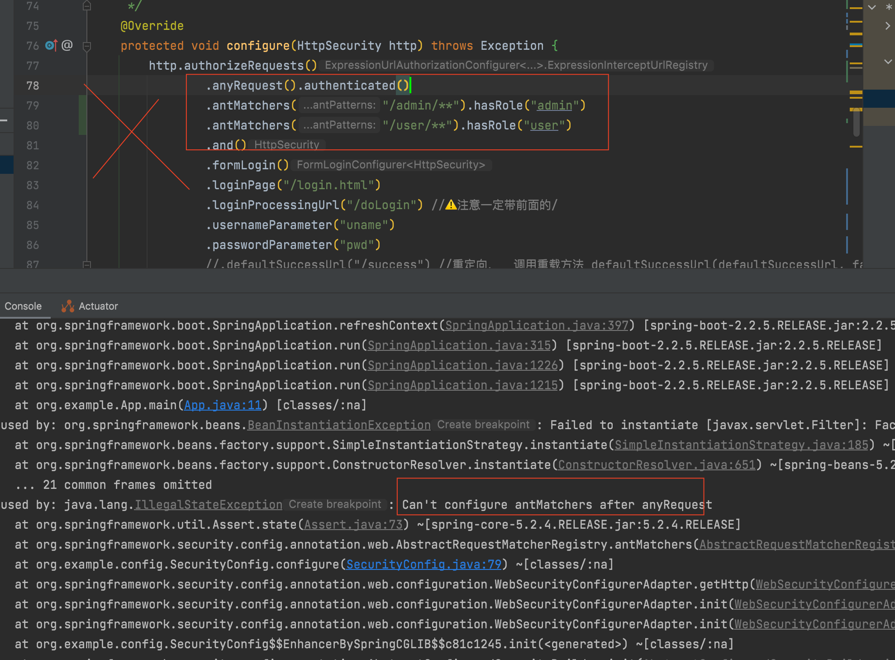
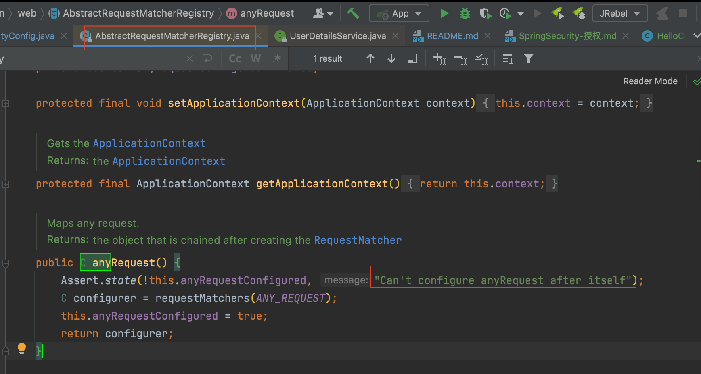
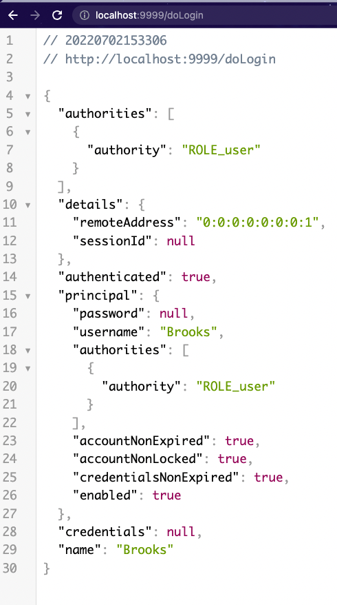
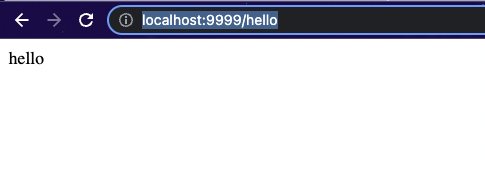
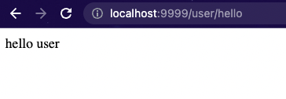
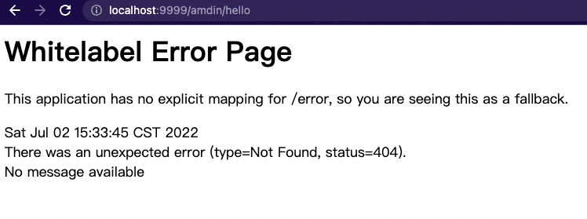
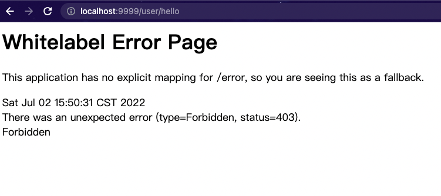
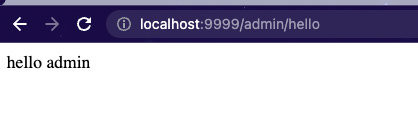
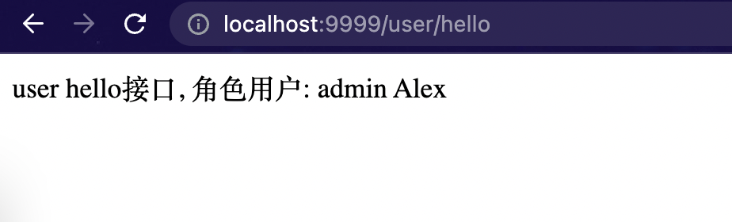

# 1.授权

所谓的授权，就是用户如果要访问某一个资源，我们要去检查用户是否具备这样的权限，如果具备就允许访问，如果不具备，则不允许访问。

# 2.准备测试用户

因为z暂时还没有连接数据库，所以测试用户还是基于内存来配置。
基于内存配置测试用户有两种方式，[前一篇文章]()介绍了第一种,如下：

```java
@Override
protected void configure(AuthenticationManagerBuilder auth) throws Exception {
            auth.inMemoryAuthentication()
            .withUser("admin")
            .password("123").roles("admin")
            .and()
            .withUser("user")
            .password("456")
            .roles("user");
}
```
本章节将介绍第二种方式：
由于 Spring Security 支持多种数据源，例如内存、数据库、LDAP 等，这些不同来源的数据被共同封装成了一个 **`UserDetailService`** 接口，任何实现了该接口的对象都可以作为认证数据源。
因此我们还可以通过重写 WebSecurityConfigurerAdapter 中的 userDetailsService 方法来提供一个 UserDetailService 实例进而配置多个用户：

```java
@Bean
protected UserDetailsService userDetailsService() {
    InMemoryUserDetailsManager manager = new InMemoryUserDetailsManager();
    manager.createUser(User.withUsername("Alex").password("123").roles("admin").build());
    manager.createUser(User.withUsername("Brooks").password("456").roles("user").build());
    return manager;
}
```
# 建好用户后准备测试接口

```java
@RestController
public class HelloController {
    @GetMapping("/hello")
    public String hello() {
        return "hello";
    }

    @GetMapping("/admin/hello")
    public String admin() {
        return "hello admin";
    }

    @GetMapping("/user/hello")
    public String user() {
        return "hello user";
    }
}
```
# 规划

对上面的三个测试接口，我们的规划是这样的：

1. /hello 是任何人都可以访问的接口
2. /admin/hello 是具有 admin 身份的人才能访问的接口
3. /user/hello 是具有 user 身份的人才能访问的接口
4. 所有 user 能够访问的资源，admin 都能够访问 (上级自动拥有下级权限。)
注意第四条规范意味着所有具备 admin 身份的人自动具备 user 身份。
拦截规则准备
5. 
接下来我们来配置权限的拦截规则，在 Spring Security 的 configure(HttpSecurity http) 方法中，代码如下：
```java
        http.authorizeRequests()
        .antMatchers("/admin/**").hasRole("admin")
        .antMatchers("/user/**").hasRole("user")
        .anyRequest().authenticated()
        .and()
        ...
        ...
```
# Ant风格简介

这里的匹配规则我们采用了 Ant 风格的路径匹配符，Ant 风格的路径匹配符在 Spring 家族中使用非常广泛，它的匹配规则也非常简单：

| tongpei | 含义             |
| ------- | ---------------- |
| **      | 匹配多层路径     |
| *       | 匹配一层路径     |
| ？      | 匹配人意单个字符 |

# 补充

如果拦截规则里配置顺序antMatchers 在anyRequest 之后则会报错：

其原理是，在`org.springframework.security.config.annotation.web.AbstractRequestMatcherRegistry`类中， 定义anyRequest()方法时， 在第一行断言， 如果之后还有拦截规则就报错


然后启动项目，

# user登陆测试

 用`user`角色用户`Brooks` / 456 登陆。 



# 分别访问上述三个接口：

`/hello`接口正常

`/user/hello`接口正常

`/admin/hello`接口404


# admin登陆测试

logout后用`admin`角色用户 `Alex` / 123 重新登陆访问上述三个接口， 发现

`/hello`接口正常

`/user/hello`接口正常

 /admin/hello接口访问正常


测试完反观前面的规划， 前三跳满足了， 但是第4条：所有 user 能够访问的资源，admin 都能够访问 (上级自动拥有下级权限。) 显然还没有实现(/user/hello接口403错误可以看出。)
要实现所有 user 能够访问的资源，admin 都能够访问，这涉及到另外一个知识点，叫做角色继承。 这在实际开发中非常有用。
上级可能具备下级的所有权限，如果使用角色继承，这个功能就很好实现，我们只需要在 SecurityConfig 中添加如下代码来配置角色继承关系即可：
```java
@Bean
RoleHierarchy roleHierarchy() {
    RoleHierarchyImpl hierarchy = new RoleHierarchyImpl();
    hierarchy.setHierarchy("ROLE_admin > ROLE_user");
    return hierarchy;
}
```

注意，在配置时，需要给角色手动加上 **`ROLE_`** 前缀。上面的配置表示 ROLE_admin 自动具备 ROLE_user 的权限。
为了方便测试观察对Controller做了修改:
```java
package org.example.controller;

import org.springframework.security.core.AuthenticatedPrincipal;
import org.springframework.security.core.Authentication;
import org.springframework.security.core.GrantedAuthority;
import org.springframework.security.core.context.SecurityContextHolder;
import org.springframework.security.core.userdetails.UserDetails;
import org.springframework.util.StringUtils;
import org.springframework.web.bind.annotation.GetMapping;
import org.springframework.web.bind.annotation.RestController;

import javax.annotation.Resource;

/**
 * @author Joshua.H.Brooks
 * @description
 * @date 2022-07-02 14:13
 */
@RestController
public class HelloController {

 @GetMapping("/hello")
 public String hello() {
  return "hello";
 }

 @GetMapping("/admin/hello")
 public String admin() {
  return "admin hello接口, 角色用户: \t" + getRoleAndUsername();
 }

 @GetMapping("/user/hello")
 public String user() {
  return "user hello接口, 角色用户: \t" + getRoleAndUsername();
 }

 String getRoleAndUsername() {
  Authentication authentication = SecurityContextHolder.getContext().getAuthentication();
  //list.stream().skip(list.size() - 1).findFirst().orElse("no last element");
  String role = authentication.getAuthorities().stream().skip(0).findFirst().orElseThrow(() -> new RuntimeException("Empty Collection")).getAuthority();
  if (role.startsWith("ROLE_")) {
   role = role.substring("ROLE_".length(), role.length());
  }
  String username = authentication.getName();
  return role + "\t" + username;
 }
}
```
# 测试:
配置完成后，重启项目测试，此时我们发现 **`admin`** 也能访问 /user/hello 这个接口了。
