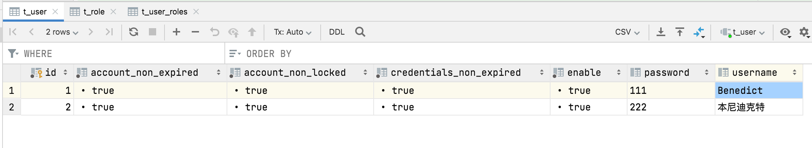
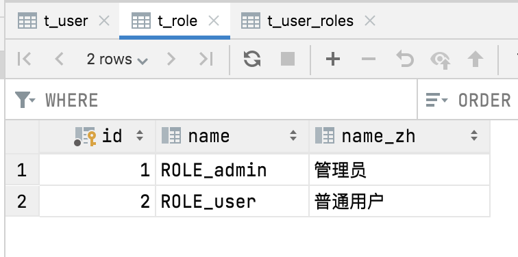
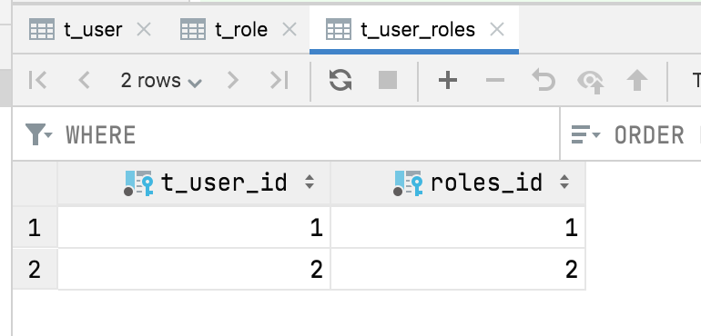
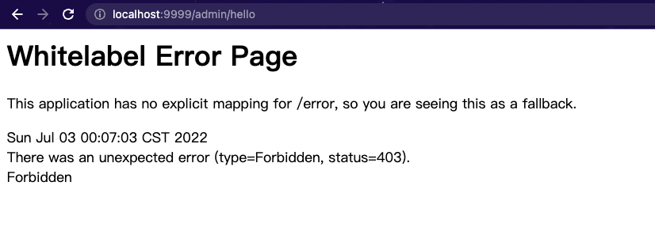
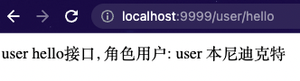
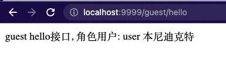

[Spring  Security系列文章]() 的第1-2篇是将用户数据保存在内存中，第3篇虽然介绍了 JdbcUserDetailsManager，但是使用起来依然不便，所以今天我要采用一个更加灵活的定义方式。
那就是我们自己来定义授权数据库的模型。 为了操作简单，我这里引入 Spring Data JPA 来帮助我们完成数据库操作。所以本篇需要对Spring Data JPA 有所了解。
<!-- more -->

# 环境准备

为了搭建使用Spring Data JPA存储用户数据的项目环境

## 1.创建工程

首先我们创建一个新的 Spring Boot 工程，添加如下依赖：

## 新增依赖

```xml
<dependency>
    <groupId>org.springframework.boot</groupId>
    <artifactId>spring-boot-starter-data-jpa</artifactId>
</dependency>
```

建库建表
```sql
create database if not exists springsecurityJPA;
```
注意⚠️不需要建表后续表会由程序根据实体类自动创建。

## 修改yml文件

将原来的`**application.yml**`文件中数据库改成JPA的库并且加上JPA相关的配置。
```yaml
server:
  port: 9999
spring:
  # security: 
  #   user:  
  #     name: Joshua
  #     password: 123
  #     roles: admin
  datasource:
    url: jdbc:mysql://localhost:3306/springsecurityJPA?useUnicode=true&serverTimezone=Asia/Shanghai&characterEncoding=utf-8&zeroDateTimeBehavior=convertToNull&useSSL=false
    username: root
    password:
    driver-class-name: com.mysql.cj.jdbc.Driver
  jpa:
    show-sql: true
    hibernate:
      ddl-auto: update
    database-platform: mysql
    properties:
      hibernate:
        dialect: org.hibernate.dialect.MySQL8Dialect
```

## 创建存储用户和角色的实体类

### 用户实体类

```java
package org.example.model;

import org.springframework.security.core.GrantedAuthority;
import org.springframework.security.core.authority.SimpleGrantedAuthority;
import org.springframework.security.core.userdetails.UserDetails;

import javax.persistence.*;
import java.util.ArrayList;
import java.util.Collection;
import java.util.List;

/**
 * @author Joshua.H.Brooks
 * @description
 * @date 2022-07-02 22:39
 */
@Entity(name = "t_user")
public class User implements UserDetails {

    /**
     * 主键id
     */
    @Id
    @GeneratedValue(strategy = GenerationType.IDENTITY)
    private Long id;
    /**
     * 用户拥有的角色
     */
    @ManyToMany(fetch = FetchType.EAGER,cascade = CascadeType.PERSIST)
    List<Role> roles;
    /**
     * username used to authenticate the user. Cannot be <code>null</code>.
     */
    private String username;
    /**
     * password used to authenticate the user.
     */
    private String password;
    /**
     * Indicates whether the user's account has expired. An expired account cannot be
     * authenticated.
     */
    private boolean accountNonExpired;
    /**
     * Indicates whether the user is locked or unlocked. A locked user cannot be
     * authenticated.
     */
    private boolean accountNonLocked;

    /**
     * Indicates whether the user's credentials (password) has expired. Expired
     * credentials prevent authentication.
     */
    private boolean credentialsNonExpired;
    /**
     * Indicates whether the user is enabled or disabled. A disabled user cannot be
     * authenticated.
     */
    private boolean enable;

    public boolean isAccountNonExpired(){
        return this.accountNonExpired;
    }

    public boolean isAccountNonLocked(){
        return this.accountNonLocked;
    }

    public boolean isCredentialsNonExpired(){
        return this.credentialsNonExpired;
    }

    public boolean isEnabled(){
        return this.enable;
    }

    /**
     * The authorities granted to the user. Cannot return null. sorted by natural key (never null)
     */
    @Override
    public Collection<? extends GrantedAuthority> getAuthorities() {
        List<SimpleGrantedAuthority> authorities = new ArrayList<>();
        for (Role role:getRoles()) {
            authorities.add(new SimpleGrantedAuthority(role.getName()));
        }
        return authorities;
    }

    @Override
    public String getPassword() {
        return this.password;
    }

    @Override
    public String getUsername() {
        return this.username;
    }

    public Long getId() {
        return id;
    }

    public List<Role> getRoles() {
        return roles;
    }

    public boolean isEnable() {
        return enable;
    }

    public void setId(Long id) {
        this.id = id;
    }

    public void setRoles(List<Role> roles) {
        this.roles = roles;
    }

    public void setUsername(String username) {
        this.username = username;
    }

    public void setPassword(String password) {
        this.password = password;
    }

    public void setAccountNonExpired(boolean accountNonExpired) {
        this.accountNonExpired = accountNonExpired;
    }

    public void setAccountNonLocked(boolean accountNonLocked) {
        this.accountNonLocked = accountNonLocked;
    }

    public void setCredentialsNonExpired(boolean credentialsNonExpired) {
        this.credentialsNonExpired = credentialsNonExpired;
    }

    public void setEnable(boolean enable) {
        this.enable = enable;
    }
}
```
注意⚠️ 用户实体类是根据接口`UserDetails`中封装的方法提取属性， 添加get方法， 并添加id和关联角色实体类Role 生成的。其他信息可以继续添加， 但是这些必须要有。
用户实体类主要需要实现 UserDetails 接口，并实现接口中的方法。 这里的字段基本都好理解，几个特殊的我来稍微说一下：
accountNonExpired、accountNonLocked、credentialsNonExpired、enabled 这四个属性分别用来描述用户的状态，表示账户是否没有过期、账户是否没有被锁定、密码是否没有过期、以及账户是否可用。
roles 属性表示用户的角色，User 和 Role 是多对多关系，用一个 @ManyToMany 注解来描述。
getAuthorities 方法返回用户的角色信息，我们在这个方法中把自己的 Role 稍微转化一下即可。

### 角色实体类

```java
package org.example.model;

import javax.persistence.Entity;
import javax.persistence.GeneratedValue;
import javax.persistence.GenerationType;
import javax.persistence.Id;

/**
 * @author Joshua.H.Brooks
 * @description
 * @date 2022-07-02 22:39
 */
@Entity(name = "t_role")
public class Role {
    @Id
    @GeneratedValue(strategy = GenerationType.IDENTITY)
    private Long id;
    private String name;
    private String nameZh;

    public Long getId() {
        return id;
    }

    public void setId(Long id) {
        this.id = id;
    }

    public String getName() {
        return name;
    }

    public void setName(String name) {
        this.name = name;
    }

    public String getNameZh() {
        return nameZh;
    }

    public void setNameZh(String nameZh) {
        this.nameZh = nameZh;
    }
}
```
## 配置Dao(继承 JpaRepository )

数据模型准备好之后，我们再来定义一个 UserDao：

```java
package org.example.dao;

import org.example.model.User;
import org.springframework.data.jpa.repository.JpaRepository;

/**
 * @author Joshua.H.Brooks
 * @description
 * @date 2022-07-02 23:03
 */
public interface UserDao extends JpaRepository<User,Long> {
    User findUserByUsername(String name);
}
```
## 配置UserService

```java
package org.example.service;

import org.example.dao.UserDao;
import org.example.model.User;
import org.springframework.beans.factory.annotation.Autowired;
import org.springframework.security.core.userdetails.UserDetails;
import org.springframework.security.core.userdetails.UserDetailsService;
import org.springframework.security.core.userdetails.UsernameNotFoundException;
import org.springframework.stereotype.Service;

/**
 * @author Joshua.H.Brooks
 * @description
 * @date 2022-07-02 23:04
 */
@Service
public class UserService implements UserDetailsService {
    @Autowired
    UserDao userDao;
    @Override
    public UserDetails loadUserByUsername(String username) throws UsernameNotFoundException {
        User user = userDao.findUserByUsername(username);
        if (user == null) {
            throw new UsernameNotFoundException("用户不存在");
        }
        return user;
    }
}
```
我们自己定义的 UserService 需要实现 UserDetailsService 接口，实现该接口，就要实现接口中的方法，也就是 loadUserByUsername ，这个方法的参数就是用户在登录的时候传入的用户名，根据用户名去查询用户信息（查出来之后，系统会自动进行密码比对）。
配置完成后，接下来我们在 Spring Security 中稍作配置，Spring Security 和测试用的 HelloController 还是沿用之前文章中的（Spring Security 如何将用户数据存入数据库？），主要列出来需要修改的地方。

## 配置authManager

在 SecurityConfig 中，我们通过如下方式来配置用户：

```java
@Autowired
UserService userService;
@Override
protected void configure(AuthenticationManagerBuilder auth) throws Exception {
    auth.userDetailsService(userService);
}
```
注意⚠️: 还是重写 configure 方法，只不过这次我们不是基于内存，也不是基于 JdbcUserDetailsManager，而是使用自定义的 UserService，就这样配置就 OK 了。


# 测试

## 启动项目插入表

启动项目发现已经建好三张表如下：


## 先往表里插入两条数据

```java
package org.example;

import org.example.dao.UserDao;
import org.example.model.Role;
import org.example.model.User;
import org.junit.jupiter.api.Test;
import org.springframework.beans.factory.annotation.Autowired;
import org.springframework.boot.test.context.SpringBootTest;

import java.util.ArrayList;
import java.util.List;

@SpringBootTest
class AppTest{


    @Autowired
    UserDao userDao;
    @Test
    void contextLoads() {
        User u1 = new User();
        u1.setUsername("Benedict");
        u1.setPassword("111");
        u1.setAccountNonExpired(true);
        u1.setAccountNonLocked(true);
        u1.setCredentialsNonExpired(true);
        u1.setEnable(true);
        List<Role> rs1 = new ArrayList<>();
        Role r1 = new Role();
        r1.setName("ROLE_admin");
        r1.setNameZh("管理员");
        rs1.add(r1);
        u1.setRoles(rs1);
        userDao.save(u1);
        User u2 = new User();
        u2.setUsername("本尼迪克特");
        u2.setPassword("222");
        u2.setAccountNonExpired(true);
        u2.setAccountNonLocked(true);
        u2.setCredentialsNonExpired(true);
        u2.setEnable(true);
        List<Role> rs2 = new ArrayList<>();
        Role r2 = new Role();
        r2.setName("ROLE_user");
        r2.setNameZh("普通用户");
        rs2.add(r2);
        u2.setRoles(rs2);
        userDao.save(u2);
    }
}
```
执行上述test可以向后台表插入两个用户信息。 对应的用户表 角色表 用户角色关联表都会新增两条数据如下：







## 访问不同接口现象


有了数据，接下来启动项目，我们来进行测试。 首先以 "本尼迪克特"的身份进行登录：
登录成功后，分别访问 /hello，/admin/hello, /user/hello 以及 /guest/hello 4个接口，其中：

/hello 因为登录后就可以访问，这个接口访问成功。 <br/>

/admin/hello 需要 admin 身份，所以访问失败。<br/>

/user/hello 需要 user 身份，所以访问成功。<br/>

/guest/hello 需要guest身份才可以访问， 又因为角色继承， user继承了guest的权限， 所以访问成功。<br/>



在测试的过程中，如果在数据库中将用户的 enabled 属性设置为 false，表示禁用该账户，此时再使用该账户登录就会登录失败。