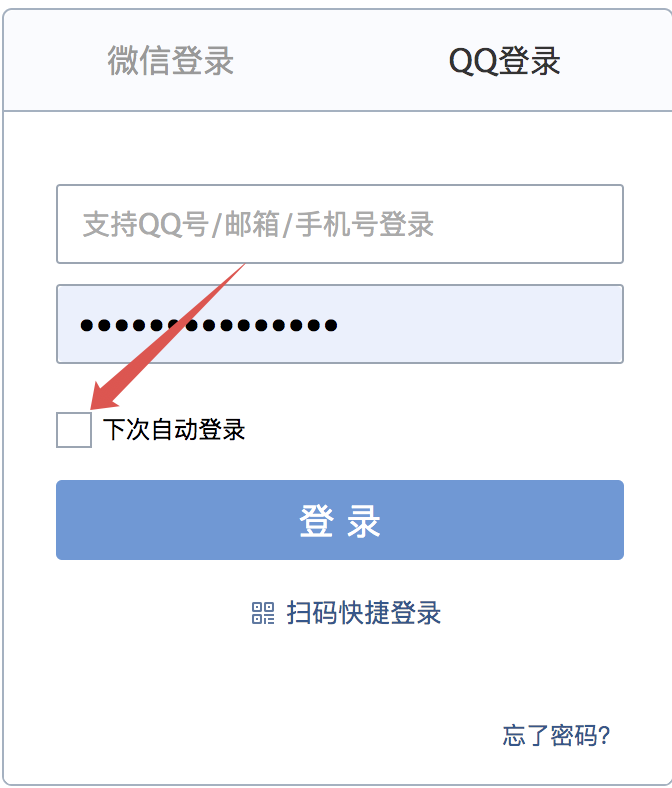
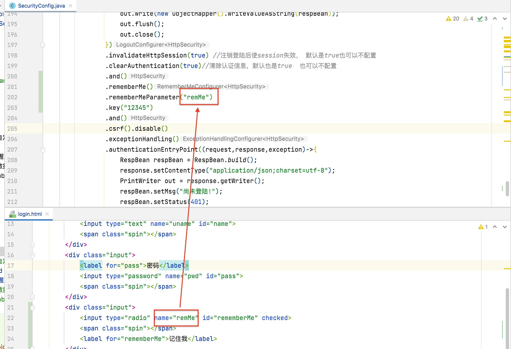
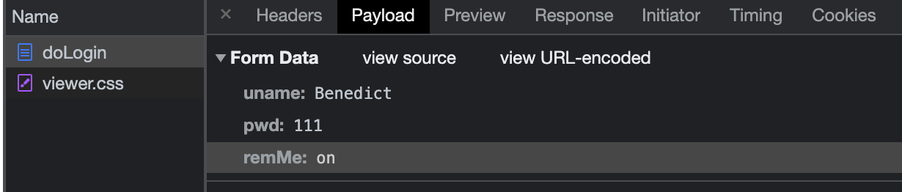
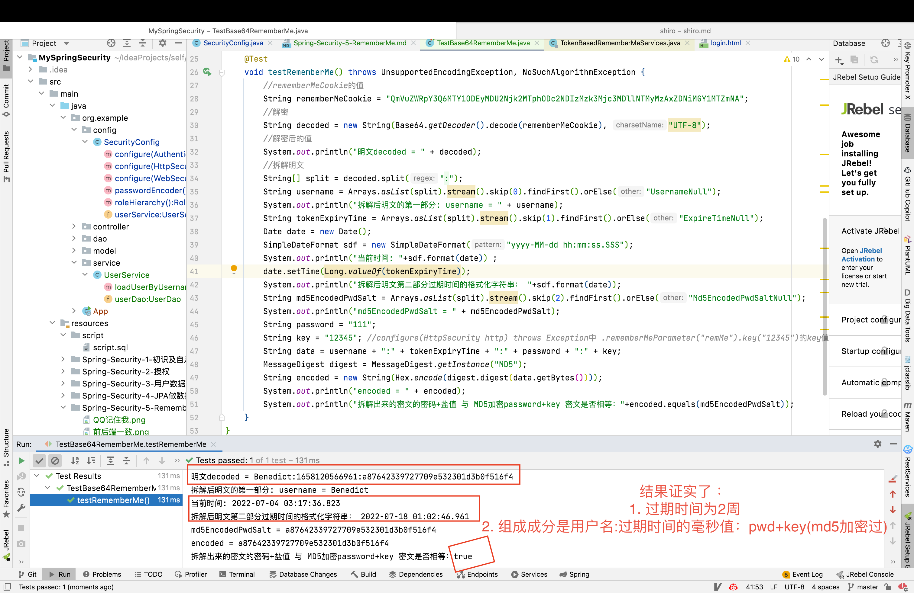
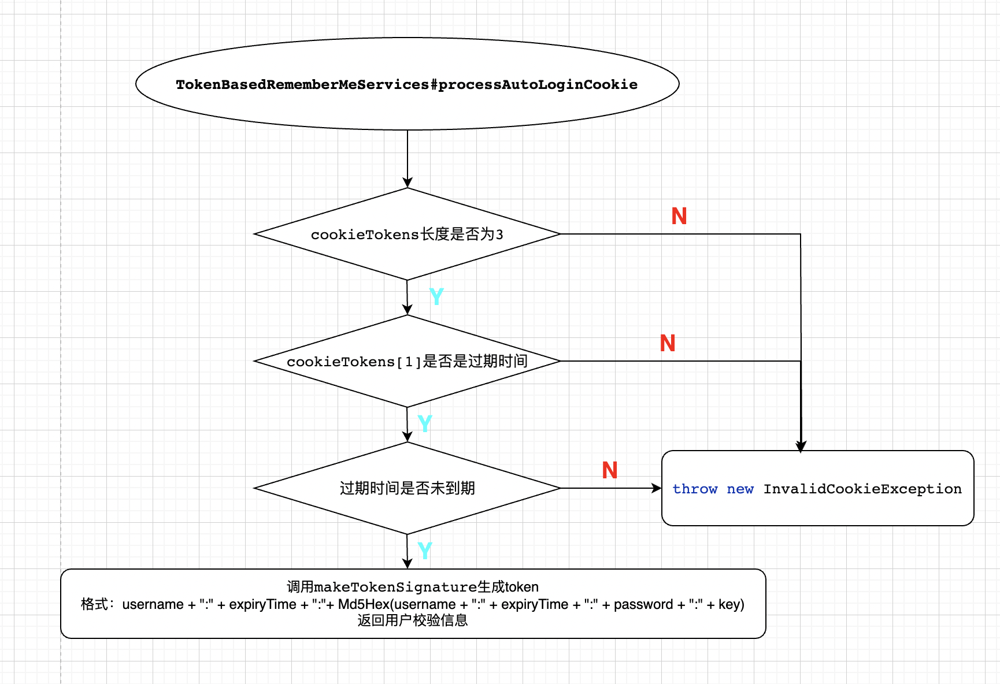
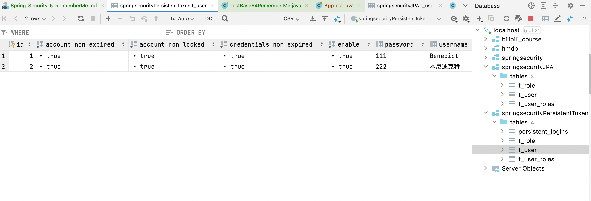
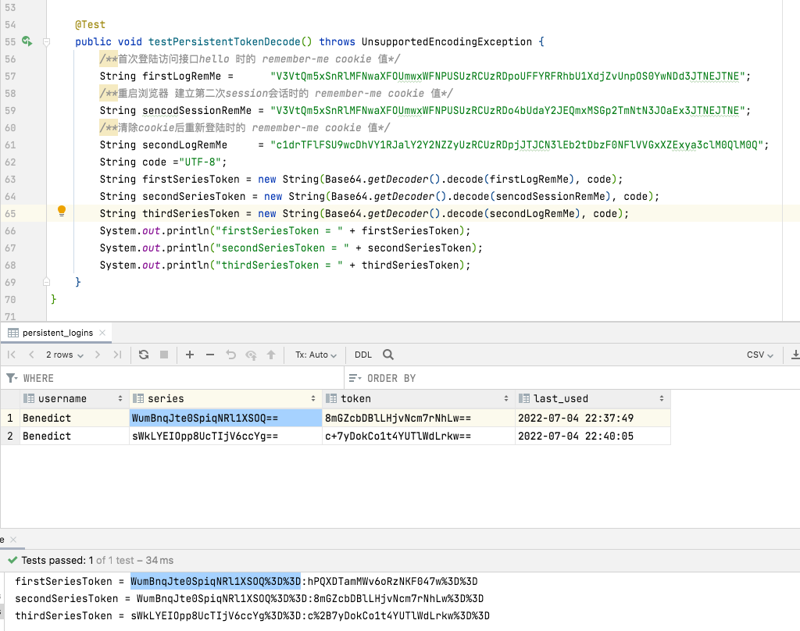
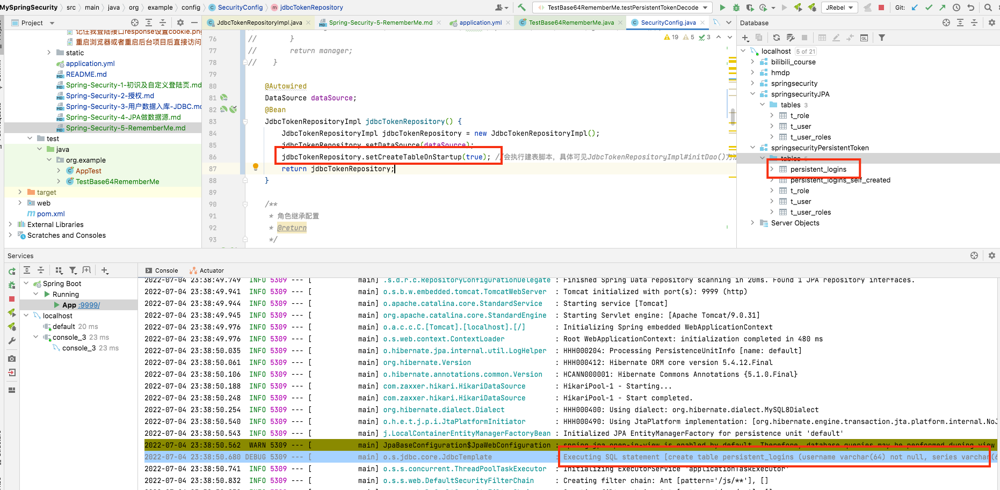

# 什么是RememberMe？
自动登录是我们在软件开发时一个非常常见的功能，例如我们登录 QQ 邮箱：

很多网站我们在登录的时候都会看到类似的选项，毕竟总让用户输入用户名密码是一件很麻烦的事。
自动登录功能就是，用户在登录成功后，在某一段时间内，如果用户关闭了浏览器并重新打开，或者服务器重启了，都不需要用户重新登录了，用户依然可以直接访问接口数据。
作为一个常见的功能，我们的 Spring Security 肯定也提供了相应的支持，本文我们就来看下 Spring Security 中如何实现这个功能。
**注意⚠️: 和Shiro的RememberMe是不同的概念 不要混淆。**
# 怎么实现？
## 修改SecurityConfig
在`protected void configure(HttpSecurity http) throws Exception {`方法中开启记住我功能
```java
  .and()
  .rememberMe()
  .rememberMeParameter("remMe")
  .key("12345")
```
在登陆页面html中增加radio输入项供用户选择是否开启rememberMe
```html
<div class="input">
    <input type="radio" name="remMe" id="rememberMe">
    <span class="spin"></span>
    <label for="rememberMe">记住我</label>
</div>
```
注意前后端开启RememberMe指定的key一样。

# 测试
## 记住我登陆
在上述配置完后启动项目， 然后访问登陆页面， 选择记住我登陆。观察HTTP请求协议里的内容。


登陆接口的表单信息中除了用户名密码还有一个remMe 也就是rememberMe的开关。

## 访问其他接口
观察上图说明记住我功能已经生效。继续测试，重启浏览器和后台项目后访问`hello`接口发现：
虽然cookie JSESSIONID的值因为重启浏览器而变更， 但是cookie remember-me的值却还是之前的。

再一次证明了RememberMe功能已经生效。
# 原理
分析刚才remember-me cookie的值，其实是使用Base64工具类加密 "用户名+过期时间(登陆时间后的两周)+md5算法加密的password和盐值(也就是SecurityConfig指定的key)。
为了证实这一结论， 对刚才的remember-me cookie进行Base64解密测试.
## 测试类验证
新建测试类 TestBase64RememberMe:
```java
package org.example;

import org.assertj.core.util.DateUtil;
import org.junit.jupiter.api.Test;
import org.springframework.boot.test.context.SpringBootTest;
import org.springframework.security.crypto.codec.Hex;
import sun.security.provider.MD5;

import java.io.UnsupportedEncodingException;
import java.security.MessageDigest;
import java.security.NoSuchAlgorithmException;
import java.text.SimpleDateFormat;
import java.util.Arrays;
import java.util.Base64;
import java.util.Calendar;
import java.util.Date;

/**
 * @author Joshua.H.Brooks
 * @description
 * @date 2022-07-03 23:12
 */
@SpringBootTest
public class TestBase64RememberMe {
    @Test
    void testRememberMe() throws UnsupportedEncodingException, NoSuchAlgorithmException {
        //rememberMeCookie的值
        String rememberMeCookie = "QmVuZWRpY3Q6MTY1ODEyMDU2Njk2MTphODc2NDIzMzk3Mjc3MDllNTMyMzAxZDNiMGY1MTZmNA";
        //解密
        String decoded = new String(Base64.getDecoder().decode(rememberMeCookie), "UTF-8");
        //解密后的值
        System.out.println("明文decoded = " + decoded);
        //拆解明文
        String[] split = decoded.split(":");
        String username = Arrays.asList(split).stream().skip(0).findFirst().orElse("UsernameNull");
        System.out.println("拆解后明文的第一部分: username = " + username);
        String tokenExpiryTime = Arrays.asList(split).stream().skip(1).findFirst().orElse("ExpireTimeNull");
        Date date = new Date();
        SimpleDateFormat sdf = new SimpleDateFormat("yyyy-MM-dd hh:mm:ss.SSS");
        System.out.println("当前时间: "+sdf.format(date)) ;
        date.setTime(Long.valueOf(tokenExpiryTime));
        System.out.println("拆解后明文第二部分过期时间的格式化字符串： "+sdf.format(date));
        String md5EncodedPwdSalt = Arrays.asList(split).stream().skip(2).findFirst().orElse("Md5EncodedPwdSaltNull");
        System.out.println("md5EncodedPwdSalt = " + md5EncodedPwdSalt);
        String password = "111";
        String key = "12345"; //configure(HttpSecurity http) throws Exception中 .rememberMeParameter("remMe").key("12345")的key值
        String data = username + ":" + tokenExpiryTime + ":" + password + ":" + key;
        MessageDigest digest = MessageDigest.getInstance("MD5");
        String encoded = new String(Hex.encode(digest.digest(data.getBytes())));
        System.out.println("encoded = " + encoded);
        System.out.println("拆解出来的密文的密码+盐值 与 MD5加密password+key 密文是否相等："+encoded.equals(md5EncodedPwdSalt));
    }
}
```
运行结果:


## 源码分析
其实底层源码在 `org.springframework.security.web.authentication.rememberme.TokenBasedRememberMeServices#onLoginSuccess#makeTokenSignature()`方法中有所体现。
```java
// 部分源码：

@Override
public void onLoginSuccess(HttpServletRequest request, HttpServletResponse response,
        Authentication successfulAuthentication) {

        String username = retrieveUserName(successfulAuthentication);
        String password = retrievePassword(successfulAuthentication);

        // If unable to find a username and password, just abort as
        // TokenBasedRememberMeServices is
        // unable to construct a valid token in this case.
        if (!StringUtils.hasLength(username)) {
        logger.debug("Unable to retrieve username");
        return;
        }

        if (!StringUtils.hasLength(password)) {
        UserDetails user = getUserDetailsService().loadUserByUsername(username);
        password = user.getPassword();

        if (!StringUtils.hasLength(password)) {
        logger.debug("Unable to obtain password for user: " + username);
        return;
        }
        }

        int tokenLifetime = calculateLoginLifetime(request, successfulAuthentication);
        long expiryTime = System.currentTimeMillis();
        // SEC-949
        expiryTime += 1000L * (tokenLifetime < 0 ? TWO_WEEKS_S : tokenLifetime);

        String signatureValue = makeTokenSignature(expiryTime, username, password);

        setCookie(new String[] { username, Long.toString(expiryTime), signatureValue },
        tokenLifetime, request, response);

        if (logger.isDebugEnabled()) {
        logger.debug("Added remember-me cookie for user '" + username
        + "', expiry: '" + new Date(expiryTime) + "'");
        }
        }
```
`org.springframework.security.web.authentication.rememberme.AbstractRememberMeServices#setCookie()`方法
```java
public static final String SPRING_SECURITY_REMEMBER_ME_COOKIE_KEY = "remember-me";
public static final String DEFAULT_PARAMETER = "remember-me";
public static final int TWO_WEEKS_S = 1209600;

protected void setCookie(String[] tokens, int maxAge, HttpServletRequest request,HttpServletResponse response) {
    String cookieValue = encodeCookie(tokens);
    Cookie cookie = new Cookie(cookieName, cookieValue);
    cookie.setMaxAge(maxAge);
    cookie.setPath(getCookiePath(request));
    if (cookieDomain != null) {
        cookie.setDomain(cookieDomain);
    }
    if (maxAge < 1) {
        cookie.setVersion(1);
    }
    if (useSecureCookie == null) {
        cookie.setSecure(request.isSecure());
    }
    else {
        cookie.setSecure(useSecureCookie);
    }
    cookie.setHttpOnly(true);response.addCookie(cookie);
}
```

## 流程总结：
源码逻辑其实很好理解：
1. 首先从登录成功的 Authentication 中提取出用户名/密码。
2. 由于登录成功之后，密码可能被擦除了，所以，如果一开始没有拿到密码，就再从 UserDetailsService 中重新加载用户并重新获取密码。
3. 再接下来去获取令牌的有效期，令牌有效期默认就是两周。
4. 再接下来调用 makeTokenSignature 方法去计算散列值，实际上就是根据 username、令牌有效期以及 password、key 一起计算一个散列值。如果我们没有自己去设置这个 key，默认是在 RememberMeConfigurer#getKey 方法中进行设置的，它的值是一个 UUID 字符串。
5. 最后，将用户名、令牌有效期以及计算得到的散列值放入 Cookie 中。
第四点容易造成误解或者陷阱，因为如果不指定的话每次启动生成的key都是一个新的UUID，之前派发出去的所有 remember-me 自动登录令牌失效。所以需要显示指定， 之后即使服务端重启，即使浏览器打开再关闭，也依然能够访问到 hello 接口。
```java
#TODO 待补充流程图
```

Spring Security 中的一系列功能都是通过一个过滤器链实现的，RememberMe 这个功能当然也不例外。Spring Security 中提供了 RememberMeAuthenticationFilter 类专门用来做相关的事情，我们来看下 RememberMeAuthenticationFilter 的 doFilter 方法：
```java
	public void doFilter(ServletRequest req, ServletResponse res, FilterChain chain) throws IOException, ServletException {
		HttpServletRequest request = (HttpServletRequest) req;
		HttpServletResponse response = (HttpServletResponse) res;
		if (SecurityContextHolder.getContext().getAuthentication() == null) {
			Authentication rememberMeAuth = rememberMeServices.autoLogin(request,response);
			if (rememberMeAuth != null) {
				// Attempt authenticaton via AuthenticationManager
				try {
					rememberMeAuth = authenticationManager.authenticate(rememberMeAuth);
					// Store to SecurityContextHolder
					SecurityContextHolder.getContext().setAuthentication(rememberMeAuth);
					onSuccessfulAuthentication(request, response, rememberMeAuth);
					if (logger.isDebugEnabled()) {
						logger.debug("SecurityContextHolder populated with remember-me token: '"
								+ SecurityContextHolder.getContext().getAuthentication()
								+ "'");
					}
					// Fire event
					if (this.eventPublisher != null) {
						eventPublisher
								.publishEvent(new InteractiveAuthenticationSuccessEvent(
										SecurityContextHolder.getContext()
												.getAuthentication(), this.getClass()));
					}
					if (successHandler != null) {
						successHandler.onAuthenticationSuccess(request, response,
								rememberMeAuth);
						return;
					}
				}
				catch (AuthenticationException authenticationException) {
					if (logger.isDebugEnabled()) {
						logger.debug(
								"SecurityContextHolder not populated with remember-me token, as "
										+ "AuthenticationManager rejected Authentication returned by RememberMeServices: '"
										+ rememberMeAuth
										+ "'; invalidating remember-me token",
								authenticationException);
					}
					rememberMeServices.loginFail(request, response);
					onUnsuccessfulAuthentication(request, response,
							authenticationException);
				}
			}
			chain.doFilter(request, response);
		}
		else {
			if (logger.isDebugEnabled()) {
				logger.debug("SecurityContextHolder not populated with remember-me token, as it already contained: '"
						+ SecurityContextHolder.getContext().getAuthentication() + "'");
			}
			chain.doFilter(request, response);
		}
	}
```
上面的逻辑解释了为什么重启后台或浏览器之后访问hello接口依然能通过过滤器放行的原因。
这个方法最关键的地方在于，如果从 SecurityContextHolder 中无法获取到当前登录用户实例，那么就调用 rememberMeServices.autoLogin 逻辑进行登录，我们来看下这个方法：
```java
@Override
	public final Authentication autoLogin(HttpServletRequest request,
			HttpServletResponse response) {
		String rememberMeCookie = extractRememberMeCookie(request);

		if (rememberMeCookie == null) {
			return null;
		}

		logger.debug("Remember-me cookie detected");

		if (rememberMeCookie.length() == 0) {
			logger.debug("Cookie was empty");
			cancelCookie(request, response);
			return null;
		}

		UserDetails user = null;

		try {
			String[] cookieTokens = decodeCookie(rememberMeCookie);
			user = processAutoLoginCookie(cookieTokens, request, response);
			userDetailsChecker.check(user);

			logger.debug("Remember-me cookie accepted");

			return createSuccessfulAuthentication(request, user);
		}
		catch (CookieTheftException cte) {
			cancelCookie(request, response);
			throw cte;
		}
		catch (UsernameNotFoundException noUser) {
			logger.debug("Remember-me login was valid but corresponding user not found.",
					noUser);
		}
		catch (InvalidCookieException invalidCookie) {
			logger.debug("Invalid remember-me cookie: " + invalidCookie.getMessage());
		}
		catch (AccountStatusException statusInvalid) {
			logger.debug("Invalid UserDetails: " + statusInvalid.getMessage());
		}
		catch (RememberMeAuthenticationException e) {
			logger.debug(e.getMessage());
		}

		cancelCookie(request, response);
		return null;
	}
```
可以看到，这里就是提取出 cookie 信息，并对 cookie 信息进行解码，解码之后，简单校验是否开启了rememberMe功能，如果开启了且cookie长度不为0，则解码，并调用子类(以为例)中的 processAutoLoginCookie 方法去做校验，如果校验通过并返回了用户信息则
processAutoLoginCookie 核心流程如下：

简单来说就是对cookie进行一系列的校验， 校验通过后将用户信息userDetails结果再返回给AbstractRememberMeServices中的userDetailsChecker实例进行校验,即：
```java
private UserDetailsChecker userDetailsChecker = new AccountStatusUserDetailsChecker();
// ... 其他代码
user = processAutoLoginCookie(cookieTokens, request, response);
userDetailsChecker.check(user);
```
而AccountStatusUserDetailsChecker#check()方法就是校验账号是否锁定，是否过期，密码是否正确这些。
```java
public void check(UserDetails user) {
    if (!user.isAccountNonLocked()) {
        throw new LockedException(messages.getMessage(
                "AccountStatusUserDetailsChecker.locked", "User account is locked"));
    }

    if (!user.isEnabled()) {
        throw new DisabledException(messages.getMessage(
                "AccountStatusUserDetailsChecker.disabled", "User is disabled"));
    }

    if (!user.isAccountNonExpired()) {
        throw new AccountExpiredException(
                messages.getMessage("AccountStatusUserDetailsChecker.expired",
        "User account has expired"));
    }

    if (!user.isCredentialsNonExpired()) {
        throw new CredentialsExpiredException(messages.getMessage(
                "AccountStatusUserDetailsChecker.credentialsExpired",
        "User credentials have expired"));
    }
}
```
如果校验过通过， 就返回return createSuccessfulAuthentication(request, user);

# 安全隐患
文章截止目前，大家可能已经发现，如果我们开启了 RememberMe 功能，最最核心的东西就是放在 cookie 中的令牌了，这个令牌突破了 session 的限制，即使服务器重启、即使浏览器关闭又重新打开，只要这个令牌没有过期，就能访问到数据。
一旦令牌丢失，别人就可以拿着这个令牌随意登录我们的系统了，这是一个非常危险的操作。
但是实际上这是一段悖论，为了提高用户体验（少登录），我们的系统不可避免的引出了一些安全问题，不过我们可以通过技术将安全风险降低到最小。

# 如何降低风险
降低安全风险，主要有如下两种方式：
## 方案一： 持久化令牌方案
### 原理
持久化令牌就是在基本的自动登录RememberMe功能基础上，又增加了新的校验参数，来提高系统的安全性，这些都是由开发者在后台完成的，对于用户来说，登录体验和普通的自动登录体验是一样的。
在持久化令牌中，新增了两个经过 MD5 散列函数计算的校验参数，一个是 series，另一个是 token。其中，**series 只有当用户在使用用户名/密码登录时，才会生成或者更新**，而 **token 只要有新的会话，就会重新生成**，这样就可以避免一个用户同时在多端登录，就像手机 QQ ，一个手机上登录了，就会踢掉另外一个手机的登录，这样用户就会很容易发现账户是否泄漏。
持久化令牌的具体处理类在 PersistentTokenBasedRememberMeServices 中，上篇文章我们讲到的自动化登录具体的处理类是在 TokenBasedRememberMeServices 中，它们有一个共同的父类

而用来保存令牌的处理类则是 PersistentRememberMeToken，该类的定义也很简洁明了，完整源码如下：
```java
package org.springframework.security.web.authentication.rememberme;

import java.util.Date;

public class PersistentRememberMeToken {
    private final String username;
    private final String series;
    private final String tokenValue;
    private final Date date;

    public PersistentRememberMeToken(String username, String series, String tokenValue, Date date) {
        this.username = username;
        this.series = series;
        this.tokenValue = tokenValue;
        this.date = date;
    }

    public String getUsername() {
        return this.username;
    }

    public String getSeries() {
        return this.series;
    }

    public String getTokenValue() {
        return this.tokenValue;
    }

    public Date getDate() {
        return this.date;
    }
}
```
其中第四个属性的含义为：上一次登陆的时间。

接下来，我通过代码来给大家演示一下持久化令牌的具体用法。

首先我们需要一张表来记录令牌信息，这张表我们可以完全自定义，也可以使用系统默认提供的 JDBC 来操作，如果使用默认的 JDBC，其实现类为 `**JdbcTokenRepositoryImpl**`，我们可以来分析一下该类的定义：
```java
package org.springframework.security.web.authentication.rememberme;

import org.springframework.dao.DataAccessException;
import org.springframework.dao.EmptyResultDataAccessException;
import org.springframework.dao.IncorrectResultSizeDataAccessException;
import org.springframework.jdbc.core.support.JdbcDaoSupport;

import java.util.*;

/**
 * JDBC based persistent login token repository implementation.
 *
 * @author Luke Taylor
 * @since 2.0
 */
public class JdbcTokenRepositoryImpl extends JdbcDaoSupport implements
		PersistentTokenRepository {
	// ~ Static fields/initializers
	// =====================================================================================

	/** Default SQL for creating the database table to store the tokens */
	public static final String CREATE_TABLE_SQL = "create table persistent_logins (username varchar(64) not null, series varchar(64) primary key, "
			+ "token varchar(64) not null, last_used timestamp not null)";
	/** The default SQL used by the <tt>getTokenBySeries</tt> query */
	public static final String DEF_TOKEN_BY_SERIES_SQL = "select username,series,token,last_used from persistent_logins where series = ?";
	/** The default SQL used by <tt>createNewToken</tt> */
	public static final String DEF_INSERT_TOKEN_SQL = "insert into persistent_logins (username, series, token, last_used) values(?,?,?,?)";
	/** The default SQL used by <tt>updateToken</tt> */
	public static final String DEF_UPDATE_TOKEN_SQL = "update persistent_logins set token = ?, last_used = ? where series = ?";
	/** The default SQL used by <tt>removeUserTokens</tt> */
	public static final String DEF_REMOVE_USER_TOKENS_SQL = "delete from persistent_logins where username = ?";

	// ~ Instance fields
	// ================================================================================================

	private String tokensBySeriesSql = DEF_TOKEN_BY_SERIES_SQL;
	private String insertTokenSql = DEF_INSERT_TOKEN_SQL;
	private String updateTokenSql = DEF_UPDATE_TOKEN_SQL;
	private String removeUserTokensSql = DEF_REMOVE_USER_TOKENS_SQL;
	private boolean createTableOnStartup;

	protected void initDao() {
		if (createTableOnStartup) {
			getJdbcTemplate().execute(CREATE_TABLE_SQL);
		}
	}

	public void createNewToken(PersistentRememberMeToken token) {
		getJdbcTemplate().update(insertTokenSql, token.getUsername(), token.getSeries(),
				token.getTokenValue(), token.getDate());
	}

	public void updateToken(String series, String tokenValue, Date lastUsed) {
		getJdbcTemplate().update(updateTokenSql, tokenValue, lastUsed, series);
	}

	/**
	 * Loads the token data for the supplied series identifier.
	 *
	 * If an error occurs, it will be reported and null will be returned (since the result
	 * should just be a failed persistent login).
	 *
	 * @param seriesId
	 * @return the token matching the series, or null if no match found or an exception
	 * occurred.
	 */
	public PersistentRememberMeToken getTokenForSeries(String seriesId) {
		try {
			return getJdbcTemplate().queryForObject(tokensBySeriesSql,
					(rs, rowNum) -> new PersistentRememberMeToken(rs.getString(1), rs
							.getString(2), rs.getString(3), rs.getTimestamp(4)), seriesId);
		}
		catch (EmptyResultDataAccessException zeroResults) {
			if (logger.isDebugEnabled()) {
				logger.debug("Querying token for series '" + seriesId
						+ "' returned no results.", zeroResults);
			}
		}
		catch (IncorrectResultSizeDataAccessException moreThanOne) {
			logger.error("Querying token for series '" + seriesId
					+ "' returned more than one value. Series" + " should be unique");
		}
		catch (DataAccessException e) {
			logger.error("Failed to load token for series " + seriesId, e);
		}

		return null;
	}

	public void removeUserTokens(String username) {
		getJdbcTemplate().update(removeUserTokensSql, username);
	}

	/**
	 * Intended for convenience in debugging. Will create the persistent_tokens database
	 * table when the class is initialized during the initDao method.
	 *
	 * @param createTableOnStartup set to true to execute the
	 */
	public void setCreateTableOnStartup(boolean createTableOnStartup) {
		this.createTableOnStartup = createTableOnStartup;
	}
}
```
观察上述源码可以知道用来存储用户登陆series token信息的表都有哪些字段.

### 实现
#### 建库建表
其中已经定义好了对Token进行持久化操作需要的默认的SQL。  分析其中的字段可以可以到退出建表需要的字段
```sql
CREATE TABLE `persistent_logins` (
  `username` varchar(64) COLLATE utf8mb4_unicode_ci NOT NULL,
  `series` varchar(64) COLLATE utf8mb4_unicode_ci NOT NULL,
  `token` varchar(64) COLLATE utf8mb4_unicode_ci NOT NULL,
  `last_used` timestamp NOT NULL DEFAULT CURRENT_TIMESTAMP ON UPDATE CURRENT_TIMESTAMP,
  PRIMARY KEY (`series`)
) ENGINE=InnoDB DEFAULT CHARSET=utf8mb4 COLLATE=utf8mb4_unicode_ci;
```
### 修改yaml 修改DB url
```sql
spring:
  datasource:
    url: jdbc:mysql://localhost:3306/springsecurityPersistentToken?useUnicode=true&serverTimezone=Asia/Shanghai&characterEncoding=utf-8&zeroDateTimeBehavior=convertToNull&useSSL=false
```
### 新增依赖
因为是需要DB交互， 所以需要MySQL 和 jdbc依赖
```xml
<dependency>
    <groupId>org.springframework.boot</groupId>
    <artifactId>spring-boot-starter-jdbc</artifactId>
</dependency>
<dependency>
    <groupId>mysql</groupId>
    <artifactId>mysql-connector-java</artifactId>
    <version>8.0.29</version>
</dependency>
```
#### 配置SecurityConfig类
提供一个 JdbcTokenRepositoryImpl 实例，并给其配置 DataSource 数据源，
```java
@Autowired
DataSource dataSource;
@Bean
JdbcTokenRepositoryImpl jdbcTokenRepository() {
    JdbcTokenRepositoryImpl jdbcTokenRepository = new JdbcTokenRepositoryImpl();
    jdbcTokenRepository.setDataSource(dataSource);
    return jdbcTokenRepository;
}
```
`SecurityConfig#configure(HttpSecurity http)`方法中在原来rememberMe的基础上关联指定要使用的JdbcTokenRepository
```java
.rememberMe()
.rememberMeParameter("remMe")
.key("12345")
.tokenRepository(jdbcTokenRepository())
```
### 测试
#### 准备用户
测试之前还是要先新增用户， 因为还是用的JPA的方式将用户信息存储到DB。所以再次执行test类中插入用户的动作AppTest#testInsertUsers()
检查数据库springsecurityPersistentToken已经多了下面三张用户和角色相关的三张表，并且里面有插入的用户记录行说明插入用户成功。

#### 启动项目并访问
启动项目并登陆访问接口观察其remember-me cookie值的变化

其中 "=" 的加密形式就是  "%3D"
从上面可以看出, 如果是新登陆/重新登陆，则想持久化令牌表里新增一条崭新的记录。如果是重新建立会话，则只是在之前的记录行上对token进行更新。
所以不管是哪种情况cookie remember-me的值和token值都会变化。通过这种变化会使得真正用户有所感知。像之前那样拿着remember-me cookie和token就能实现自动登陆的功能就不再

### 补充
对JdbcTokenRepositoryImpl源码分析可知， 不用自己建表而是通过setCreateTableOnStartup(true)来让initDao()执行建表脚本， 为了验证这一想法，
JdbcTokenRepositoryImpl#initDao()
```java
protected void initDao() {
	if (createTableOnStartup) {
		getJdbcTemplate().execute(CREATE_TABLE_SQL);
	}
}
```
JdbcTemplate#execute(final String sql)源码 (只是为了知道需要看见启动日志中的建表信息需要对jdbcTemplate开启debug日志)
```java
 public void execute(final String sql) throws DataAccessException{
    if(this.logger.isDebugEnabled()){
        this.logger.debug("Executing SQL statement ["+sql+"]");
    }
}        
```
#### 开启日志
```yaml
logging:
  level:
    org.example.dao: DEBUG
    org.springframework.jdbc.core.JdbcTemplate: DEBUG
```
#### 旧表重命名 
将原来的表重命名
```sql
rename table `persistent_logins` to `persistent_logins_self_created`
```
在原来的jdbcTokenRepository()中开启createTableOnStartup
```java
@Bean
JdbcTokenRepositoryImpl jdbcTokenRepository() {
    JdbcTokenRepositoryImpl jdbcTokenRepository = new JdbcTokenRepositoryImpl();
    jdbcTokenRepository.setDataSource(dataSource);
    jdbcTokenRepository.setCreateTableOnStartup(true); //会执行建表脚本，具体可见JdbcTokenRepositoryImpl#initDao()
    return jdbcTokenRepository;
}
```
但是要注意这种方式如果之后重启会导致表已存在的错误： **Table 'persistent_logins' already exists** 应该修改逻辑避免。
#### 测试
重启项目发现启动日志中打印了建表日志, 并且有新表生成。如图


## 方案二： 二次校验方案
### 原理
另外一种解决自动登录安全问题的方案其实是一种折中方案， 就是对敏感信息在记住我方式访问时需要二次登陆校验通过才可以， 而非敏感信息可以直接查看。
这种方式需要用户/开发人员去定义哪些为敏感信息。（一般情况写操作和极其重要的数据如金额，身份证ID等的读为敏感，其他读操作为非敏感)。
### 实现
还是之前的四个接口，角色继承和权限访问关系不变， 在此基础上添加一条， 路径带/admin的需要二次交验， 而带/user的只需要rememberme就可以访问
/hello
/guest/hello
/user/hello
/admin/hello
在原来的的SecurityConfig#中添加如下行，表示
```java
.antMatchers("/user/**").rememberMe()
.antMatchers("/admin/**").fullyAuthenticated()
```
### 测试
