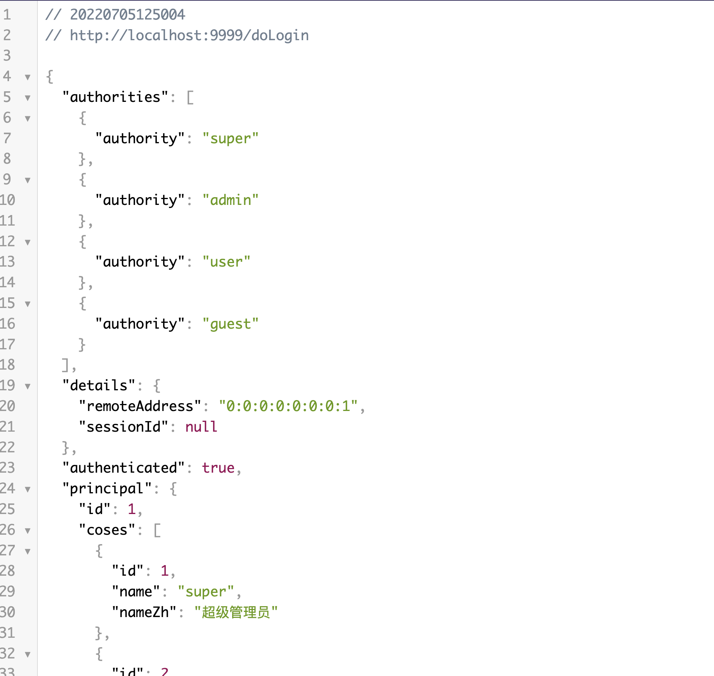

之前的章节介绍过用JPA进行数据交互存储用户数据信息，今天将介绍如何使用MyBatis作为持久层框架搭配Spring Security进行用户校验。
原理和之前JPA的一致。
<!-- more -->
# 环境准备
## 建库建表(并插入用户数据用于后续测试)
```sql
create database if not exists springsecurityMybatis;
use springsecurityMybatis;

create table if not exists client(
    `id` bigint NOT NULL AUTO_INCREMENT,
    `name` varchar(255) DEFAULT NULL,
    `phone`varchar(255) DEFAULT NULL,
    `telephone`varchar(255) DEFAULT NULL,
    `address`varchar(255) DEFAULT NULL,
    `userface`varchar(255) DEFAULT NULL,
    `remarks`varchar(255) DEFAULT NULL,
    `account_non_expired` bit(1) NOT NULL DEFAULT 1,
    `account_non_locked` bit(1) NOT NULL DEFAULT 1,
    `credentials_non_expired` bit(1) NOT NULL DEFAULT 1,
    `enable` bit(1) NOT NULL DEFAULT 1,
    `password` varchar(255) DEFAULT NULL,
    `username` varchar(255) DEFAULT NULL,
    PRIMARY KEY (`id`)
)ENGINE=InnoDB DEFAULT CHARSET=utf8mb4 COLLATE=utf8mb4_0900_ai_ci;
create table if not exists cos(
   `id` bigint NOT NULL AUTO_INCREMENT,
   `name` varchar(255) DEFAULT NULL,
   `name_zh` varchar(255) DEFAULT NULL,
    PRIMARY KEY (`id`)
)ENGINE=InnoDB DEFAULT CHARSET=utf8mb4 COLLATE=utf8mb4_0900_ai_ci;

create table if not exists client_cos_relation(
    `id` bigint NOT NULL AUTO_INCREMENT,
    `client_id` bigint NOT NULL,
    `cos_id` bigint NOT NULL ,
    PRIMARY KEY (`id`)
)ENGINE=InnoDB DEFAULT CHARSET=utf8mb4 COLLATE=utf8mb4_0900_ai_ci;
-- 插入数据
-- 用户优先级/权限 由大到小 (super > admin > user > guest)
insert into client_cos_relation (id,client_id,cos_id) values
 (1,1,1),(2,1,2),(3,1,3),(4,1,4)
,(5,2,2),(6,2,3),(7,2,4)
,(8,3,3),(9,3,4)
,(10,4,4);
insert into client
    (name, phone, telephone, address, userface, remarks, account_non_expired, account_non_locked, credentials_non_expired, enable, password, username)
    values
     ('Benedict','123','020-123','Manchester','face1','haha',1,1,1,1,'111','Benedict')
    ,('本尼迪克特','123','021-123','曼彻斯特','face2','hehe',1,1,1,1,'111','本尼迪克特')
    ,('卷福','123','027-123','曼城','face3','呵呵',1,1,1,1,'111','卷福');
insert into cos (id, name, name_zh) VALUES (1, 'super','超级管理员'),(2,'admin','管理员'),(3,'user','普通用户'),(4,'guest','访客');
```
## 建实体类
```java
package org.example.model;

import com.fasterxml.jackson.annotation.JsonIgnore;
import org.springframework.security.core.GrantedAuthority;
import org.springframework.security.core.authority.SimpleGrantedAuthority;
import org.springframework.security.core.userdetails.UserDetails;

import java.util.ArrayList;
import java.util.Collection;
import java.util.List;

/**
 * @author Joshua.H.Brooks
 * @description
 * 用来演示使用Mybatis作为持久层框架的例子中的实体类(等价于原来整合JPA例子中的User类)
 * 注意: 除了UserDetails里是必须的，其他都是用户可以自己定义添加的
 * @date 2022-07-05 10:32
 */
public class Client implements UserDetails {
    /**
     * 主键id
     */
    private Long id;
    /**
     * 用户拥有的角色
     */
    List<Cos> coses;
    /**
     * username used to authenticate the user. Cannot be <code>null</code>.
     */
    private String username;
    /**
     * password used to authenticate the user.
     */
    private String password;
    /**
     * Indicates whether the user's account has expired. An expired account cannot be
     * authenticated.
     */
    private boolean accountNonExpired;
    /**
     * Indicates whether the user is locked or unlocked. A locked user cannot be
     * authenticated.
     */
    private boolean accountNonLocked;

    /**
     * Indicates whether the user's credentials (password) has expired. Expired
     * credentials prevent authentication.
     */
    private boolean credentialsNonExpired;
    /**
     * Indicates whether the user is enabled or disabled. A disabled user cannot be
     * authenticated.
     */
    private boolean enable;

    private String name;
    private String phone;
    private String telephone;
    private String address;
    private String userface;
    private String remarks;

    @Override
    public String getUsername() {
        return username;
    }

    @Override
    public String getPassword() {
        return password;
    }
    @Override
    public boolean isAccountNonExpired(){
        return this.accountNonExpired;
    }
    @Override
    public boolean isAccountNonLocked(){
        return this.accountNonLocked;
    }
    @Override
    public boolean isCredentialsNonExpired(){
        return this.credentialsNonExpired;
    }
    @Override
    public boolean isEnabled(){
        return this.enable;
    }

    public Long getId() {
        return id;
    }

    public List<Cos> getCoses() {
        return coses;
    }

    public boolean isEnable() {
        return enable;
    }
    @Override
    @JsonIgnore
    public Collection<? extends GrantedAuthority> getAuthorities(){
        List<SimpleGrantedAuthority> authorities = new ArrayList<>();
        for (Cos cos:getCoses()) {
            authorities.add(new SimpleGrantedAuthority(cos.getName()));
        }
        return authorities;
    }

    public String getName() {
        return name;
    }

    public void setName(String name) {
        this.name = name;
    }

    public String getPhone() {
        return phone;
    }

    public void setPhone(String phone) {
        this.phone = phone;
    }

    public String getTelephone() {
        return telephone;
    }

    public void setTelephone(String telephone) {
        this.telephone = telephone;
    }

    public String getAddress() {
        return address;
    }

    public void setAddress(String address) {
        this.address = address;
    }

    public String getUserface() {
        return userface;
    }

    public void setUserface(String userface) {
        this.userface = userface;
    }

    public String getRemarks() {
        return remarks;
    }

    public void setRemarks(String remarks) {
        this.remarks = remarks;
    }

    public void setCoses(List<Cos> coses) {
        this.coses = coses;
    }

    @Override
    public String toString() {
        return "Client{" +
                "id=" + id +
                ", coses=" + coses +
                ", username='" + username + '\'' +
                ", password='" + password + '\'' +
                ", accountNonExpired=" + accountNonExpired +
                ", accountNonLocked=" + accountNonLocked +
                ", credentialsNonExpired=" + credentialsNonExpired +
                ", enable=" + enable +
                ", name='" + name + '\'' +
                ", phone='" + phone + '\'' +
                ", telephone='" + telephone + '\'' +
                ", address='" + address + '\'' +
                ", userface='" + userface + '\'' +
                ", remarks='" + remarks + '\'' +
                '}';
    }
}
```
## 建Dao Service
```java
@Repository
public interface CosMapper {
    public List<Cos> loadCosesByUid(@Param("clientId") Long cid);
}
```

```java
@Repository
public interface ClientMapper {
    public Client loadUserByUsername(@Param("username") String username);
}
```
## 建Service
```java
package org.example.service;

import org.example.dao.ClientMapper;
import org.example.dao.CosMapper;
import org.example.model.Client;
import org.example.model.Cos;
import org.springframework.security.core.userdetails.UserDetails;
import org.springframework.security.core.userdetails.UserDetailsService;
import org.springframework.security.core.userdetails.UsernameNotFoundException;
import org.springframework.stereotype.Service;

import javax.annotation.Resource;
import java.util.List;

/**
 * @author Joshua.H.Brooks
 * @description
 * @date 2022-07-05 11:12
 */
@Service
public class ClientService implements UserDetailsService {
    @Resource
    ClientMapper clientMapper;
    @Resource
    CosMapper cosMapper;
    @Override
    public UserDetails loadUserByUsername(String username) throws UsernameNotFoundException {
        Client client = clientMapper.loadUserByUsername(username);
        System.out.println("查询到的 client = " + client);
        if(client == null){
            throw new UsernameNotFoundException("当前用户名不存在: "+username);
        }
        System.out.println("其具有的角色权限如下");
        List<Cos> coses = cosMapper.loadCosesByUid(client.getId());
        client.setCoses(coses);
        coses.stream().forEach(System.out::println);
        return client;
    }
}
```
## 修改SecurityConfig#configure(httpSecurity)
注意⚠️: 要将原来持久化令牌方案解决记住我功能时的相关配置注释掉， 如果保留就要响应做好建表或者开启首次
这里直接注释掉了
```java
// 注释掉使用持久化令牌的配置
//.tokenRepository(jdbcTokenRepository())
// 注释掉jdbcTokenRepository bean
//    @Bean
//    JdbcTokenRepositoryImpl jdbcTokenRepository() {
//        JdbcTokenRepositoryImpl jdbcTokenRepository = new JdbcTokenRepositoryImpl();
//        jdbcTokenRepository.setDataSource(dataSource);
//        //只能执行一次 之后再执行会报错 Table 'persistent_logins' already exists
//        jdbcTokenRepository.setCreateTableOnStartup(true); //会执行建表脚本，具体可见JdbcTokenRepositoryImpl#initDao()方法
//        return jdbcTokenRepository;
//    }

//添加了super角色继承关系
@Bean
RoleHierarchy roleHierarchy() {
    RoleHierarchyImpl hierarchy = new RoleHierarchyImpl();
    hierarchy.setHierarchy("ROLE_super > ROLE_admin > ROLE_user > ROLE_guest"); 
    return hierarchy;
}

// 注入clientService 并关联使用这个service做authentication
@Autowired
ClientService clientService;
@Override
protected void configure(AuthenticationManagerBuilder auth) throws Exception {
        auth.userDetailsService(clientService);
        //auth.userDetailsService(userService);
}
```

# 测试
## 登陆
启动项目 访问登陆页面：`http://localhost:9999/login.html`
使用Benedict用户(具有超级管理员角色，四个权限都有) 登陆，发现返回JSON如下
```json
{
  "authorities": [
    {
      "authority": "super"
    },
    {
      "authority": "admin"
    },
    {
      "authority": "user"
    },
    {
      "authority": "guest"
    }
  ],
  "details": {
    "remoteAddress": "0:0:0:0:0:0:0:1",
    "sessionId": null
  },
  "authenticated": true,
  "principal": {
    "id": 1,
    "coses": [
      {
        "id": 1,
        "name": "super",
        "nameZh": "超级管理员"
      },
      {
        "id": 2,
        "name": "admin",
        "nameZh": "管理员"
      },
      {
        "id": 3,
        "name": "user",
        "nameZh": "普通用户"
      },
      {
        "id": 4,
        "name": "guest",
        "nameZh": "访客"
      }
    ],
    "username": "Benedict",
    "password": "111",
    "accountNonExpired": true,
    "accountNonLocked": true,
    "credentialsNonExpired": true,
    "enable": true,
    "name": "Benedict",
    "phone": "123",
    "telephone": "020-123",
    "address": "Manchester",
    "userface": "face1",
    "remarks": "haha",
    "enabled": true
  },
  "credentials": null,
  "name": "Benedict"
}
```

## 访问hello等4个接口
发现只能访问 /hello接口， 其他三个都返回**403** 说明权限有问题。仔细观察上面返回的JSON数据中角色并没有像之前JPA中的"ROLE_"前缀
即使在`SecurityConfig#roleHierarchy()`加了：
```java
hierarchy.setHierarchy("super > admin > user > guest");
```
重启项目， 角色权限继承依然没有生效。

这个问题的解决待到后续文章处理。

# <span style="color:red"> TODO MyBatis实现角色权限继承 </span>


