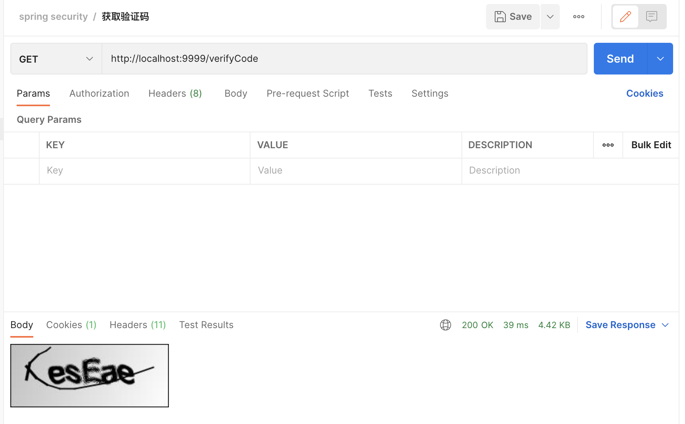
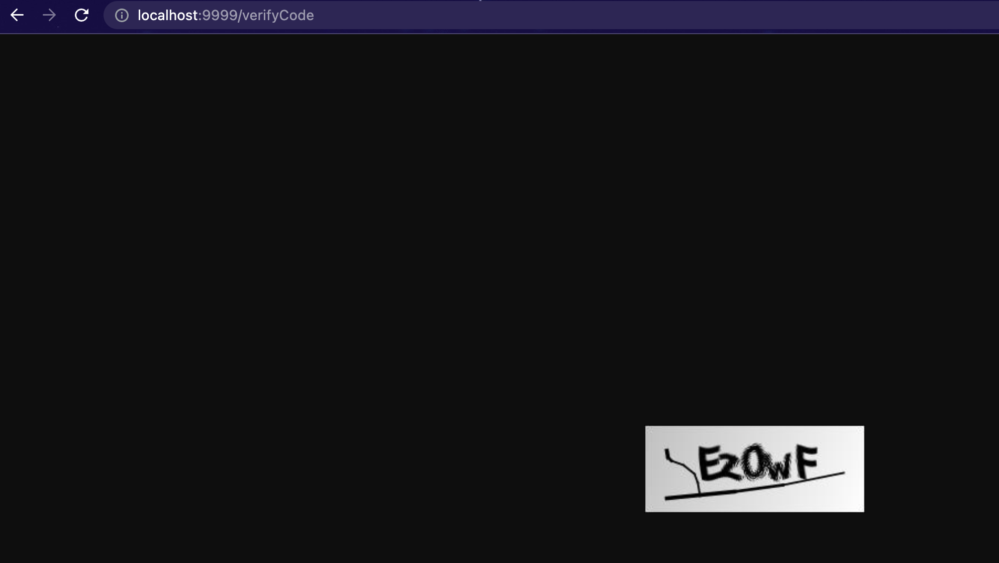
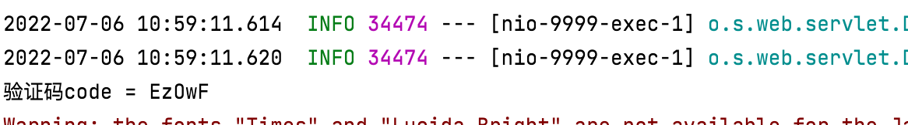
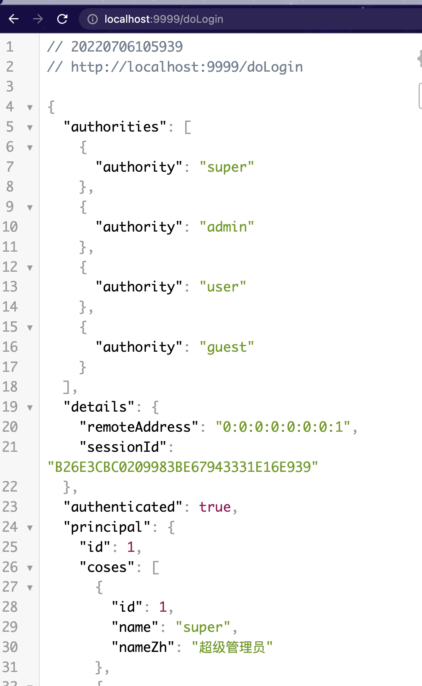
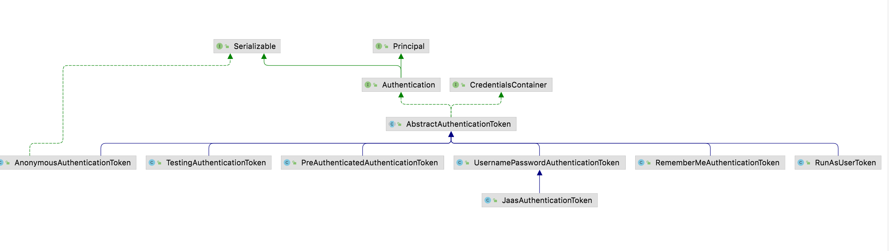

本文将通过验证码校验的例子来演示自定义**`AuthenticationProvider / WebAuthenticationDetails`** 以重新规划登陆认证流程，最终深入理解AuthenticationProvider底层原理。
<!-- more -->
 ```java
/**
 * Processes an Authentication request.
 */
public interface AuthenticationManager {
    /**
     * Attempts to authenticate the passed Authentication object, returning a fully populated Authentication object (including granted authorities) if successful.
     */
    Authentication authenticate(Authentication authentication) throws AuthenticationException;
}

```

```java

/**
 * Indicates a class can process a specific Authentication implementation
 */
public interface AuthenticationProvider {
    /**
     * Performs authentication with the same contract as AuthenticationManager.authenticate(Authentication).
     */
    Authentication authenticate(Authentication authentication) throws AuthenticationException;

    /**
     * Returns true if this AuthenticationProvider supports the indicated Authentication object.
     */
    boolean supports(Class<?> authentication);
}
```

# 环境准备
## 准备验证码
### 引入依赖
```xml
 <!--验证码的开源依赖-->
<dependency>
    <groupId>com.github.penggle</groupId>
    <artifactId>kaptcha</artifactId>
    <version>2.3.2</version>
</dependency>
```

### 验证码配置
新建验证码配置类 设定生成验证码的基本参数

```java
package org.example.config;

import com.google.code.kaptcha.Producer;
import com.google.code.kaptcha.impl.DefaultKaptcha;
import com.google.code.kaptcha.util.Config;
import org.springframework.context.annotation.Bean;
import org.springframework.context.annotation.Configuration;

import java.util.Properties;

/**
 * @author Joshua.H.Brooks
 * @description 验证码相关的配置
 * @date 2022-07-05 22:53
 */
@Configuration
public class VerifyCodeConfig {
    @Bean
    Producer verifyCode() {
        Properties properties = new Properties();
        properties.setProperty("kaptcha.image.width", "200");
        properties.setProperty("kaptcha.image.height", "80");
        properties.setProperty("kaptcha.textproducer.char.string", "0123456789abcdefghijklmnopqrstuvwxyzABCDEFGHIJKLMNOPQRSTUVWXYZ"); // 组成验证码的字符集
        properties.setProperty("kaptcha.textproducer.char.length", "5"); // 验证码长度
        DefaultKaptcha defaultKaptcha = new DefaultKaptcha();
        defaultKaptcha.setConfig(new Config(properties));
        return defaultKaptcha;
    }
}
```
### 验证码controller

```java
package org.example.controller;

import com.google.code.kaptcha.Producer;
import org.springframework.beans.factory.annotation.Autowired;
import org.springframework.web.bind.annotation.RequestMapping;
import org.springframework.web.bind.annotation.RequestMethod;
import org.springframework.web.bind.annotation.RestController;

import javax.imageio.ImageIO;
import javax.servlet.ServletOutputStream;
import javax.servlet.http.HttpServletResponse;
import javax.servlet.http.HttpSession;
import java.awt.image.BufferedImage;
import java.io.IOException;

/**
 * @author Joshua.H.Brooks
 * @description
 * @date 2022-07-05 23:04
 */
@RestController
public class VerifyCodeController {

    @Autowired
    Producer producer;

    @RequestMapping(value = "verifyCode", method = RequestMethod.GET)
    public void getCode(HttpServletResponse response, HttpSession httpSession) throws IOException {
        //指明返回图片
        response.setContentType("image/jpeg");
        //生成文本
        String code = producer.createText();
        System.out.println("验证码code = " + code);
        //生成含有上述文本的图片
        BufferedImage bufferedImage = producer.createImage(code);
        //将图片bufferedImage按"JPG"格式写到输出流out返回 
        try (ServletOutputStream jos = response.getOutputStream()) {
            ImageIO.write(bufferedImage, "jpg", jos);
        }
    }
}
```
### 过滤器设置
为了测试验证码生成接口的方便, 修改`SecurityConfig#configure(HttpSecurity http)`添加如下行 以放行。
```java
.antMatchers("/verifyCode").permitAll()
```

## 验证码生成测试
启动项目请求 `http://localhost:9999/verifyCode` 看返回信息如下：

验证码生成成功。

## AuthenticationProvider 实现认证
自定义 AuthenticationProvider : MyAuthenticationProvider
```java
package org.example.config;

import org.springframework.security.authentication.AuthenticationServiceException;
import org.springframework.security.authentication.UsernamePasswordAuthenticationToken;
import org.springframework.security.authentication.dao.DaoAuthenticationProvider;
import org.springframework.security.core.AuthenticationException;
import org.springframework.security.core.userdetails.UserDetails;
import org.springframework.web.context.request.RequestContextHolder;
import org.springframework.web.context.request.ServletRequestAttributes;

import javax.servlet.http.HttpServletRequest;

/**
 * @author Joshua.H.Brooks
 * @description
 * @date 2022-07-05 23:31
 */
public class MyAuthenticationProvider extends DaoAuthenticationProvider {
    /** 下面是抽象类 AbstractUserDetailsAuthenticationProvider#additionalAuthenticationChecks()方法的注释。
     * Allows subclasses to perform any additional checks of a returned (or cached) UserDetails for a given authentication request.
     * Generally a subclass will at least compare the Authentication.getCredentials() with a UserDetails.getPassword().
     * If custom logic is needed to compare additional properties of UserDetails and/or UsernamePasswordAuthenticationToken,
     * these should also appear in this method.
     * @param userDetails
     * @param authentication
     * @throws AuthenticationException
     */
    @Override
    protected void additionalAuthenticationChecks(UserDetails userDetails, UsernamePasswordAuthenticationToken authentication) throws AuthenticationException {
        HttpServletRequest request = ((ServletRequestAttributes) RequestContextHolder.getRequestAttributes()).getRequest();
        //用户前端输入的
        String code = request.getParameter("code");
        //后台生成的
        String verifyCode = (String) request.getSession().getAttribute("verifyCode");
        if(verifyCode == null || code == null || !code.equals(verifyCode)){
            throw new AuthenticationServiceException("验证么输入错误, 请注意大小写哦～");
        }
        super.additionalAuthenticationChecks(userDetails, authentication);
    }
}
```

##修改`SecurityConfig` 
添加如下配置
1。 配置自定义的AuthticationProvider 并注入Spring容器
2。 把自定义的AuthticationProvider：MyAuthenticationProvider 交由AuthenticationManager管理。就会在认证时执行里面的逻辑
3。 在rememberMe配置后也加上关联: clientService 的配置。
```java
 //
@Bean
MyAuthenticationProvider myAuthenticationProvider(){
    MyAuthenticationProvider myAuthenticationProvider = new MyAuthenticationProvider();
    myAuthenticationProvider.setPasswordEncoder(passwordEncoder());
    myAuthenticationProvider.setUserDetailsService(clientService);
    return myAuthenticationProvider;
}

@Override
@Bean
protected AuthenticationManager authenticationManager() throws Exception {
    ArrayList<AuthenticationProvider> pms = new ArrayList<>();
    pms.add(myAuthenticationProvider());
    return new ProviderManager(pms); //版本不同, 之前有可变参数的构造 该版本只能是List<AuthenticationProvider>参数构造了
}
// *******
.userDetailsService(clientService)
```
为了能在前端接收用户输入，修改login.html 添加
```html
<div class="input">
    <input type="text" name="code" id="vCode">
    <label for="rememberMe">验证码:</label>
</div>
```
# 测试
访问: 重启项目首先获取验证码.




# 查看IP地址等
## Authentication源码分析

```java
/**
 * Represents the token for an authentication request or for an authenticated principal once the request has been processed by the AuthenticationManager.authenticate(Authentication) method.
 */
public interface Authentication extends Principal, Serializable {
    /**
     * Set by an AuthenticationManager to indicate the authorities that the principal has been granted. Note that classes should not rely on this value as being valid unless it has been set by a trusted AuthenticationManager.
     */
    Collection<? extends GrantedAuthority> getAuthorities();

    /**
     * The credentials that prove the principal is correct. This is usually a password, but could be anything relevant to the AuthenticationManager. Callers are expected to populate the credentials.
     */
    Object getCredentials();

    /**
     * Stores additional details about the authentication request. These might be an IP address, certificate serial number etc.
     */
    Object getDetails();

    /**
     * The identity of the principal being authenticated. In the case of an authentication request with username and password, this would be the username. Callers are expected to populate the principal for an authentication request.
     */
    Object getPrincipal();

    /***/
    boolean isAuthenticated();

    /***/
    void setAuthenticated(boolean isAuthenticated) throws IllegalArgumentException;
}
```
可以看出Authentication是对Principal的进一步封装。其中的方法: getDetails q其注释表示该方法用来获取用户携带的额外信息，可能是当前请求的 例如 IP 地址、证书信息等等。之类的东西。
实际上，在默认情况下，这里存储的就是用户登录的 `IP` 地址和 `sessionId`。我们从源码角度来看下。
用户登录必经的一个过滤器就是 `UsernamePasswordAuthenticationFilter`，在该类的 `attemptAuthentication` 方法中，对请求参数做提取，在 `attemptAuthentication` 方法中，会调用到一个方法，就是 `setDetails`。
```java
protected void setDetails(HttpServletRequest request,
		UsernamePasswordAuthenticationToken authRequest) {
	authRequest.setDetails(authenticationDetailsSource.buildDetails(request));
}
```
从`Authentication`的继承体系可以看出`UsernamePasswordAuthenticationToken` 是 `Authentication` 的具体实现，所以这里实际上就是在设置 `details`. 


至于 `details` 的值，则是通过 `authenticationDetailsSource` 来构建的. 我们来看下：
```java
public class WebAuthenticationDetailsSource implements
		AuthenticationDetailsSource<HttpServletRequest, WebAuthenticationDetails> {
	public WebAuthenticationDetails buildDetails(HttpServletRequest context) {
		return new WebAuthenticationDetails(context);
	}
}
public class WebAuthenticationDetails implements Serializable {
	private final String remoteAddress;
	private final String sessionId;
	public WebAuthenticationDetails(HttpServletRequest request) {
		this.remoteAddress = request.getRemoteAddr();

		HttpSession session = request.getSession(false);
		this.sessionId = (session != null) ? session.getId() : null;
	}
    //省略其他方法
}
```
默认通过 WebAuthenticationDetailsSource 来构建 WebAuthenticationDetails，并将结果设置到 Authentication 的 details 属性中去。而 WebAuthenticationDetails 中定义的属性，大家看一下基本上就明白，这就是保存了用户登录地址和 sessionId。

那么看到这里，大家基本上就明白了，用户登录的 IP 地址实际上我们可以直接从 WebAuthenticationDetails 中获取到。
我举一个简单例子，例如我们登录成功后，可以通过如下方式随时随地拿到用户 IP：
```java
@Service
public class GetDetailsIPSession {
    public void GetDetailsIPSession() {
        Authentication authentication = SecurityContextHolder.getContext().getAuthentication();
        WebAuthenticationDetails details = (WebAuthenticationDetails) authentication.getDetails();
        System.out.println(details);
    }
}
```
这个获取过程之所以放在 service 来做，就是为了演示随时随地这个特性。然后我们在 controller 中调用该方法，当访问接口时，可以看到如下日志：
## 自定义WebAuthenticationDetails重构校验逻辑
可以看到，用户的 IP 地址和 SessionId 都给出来了。这两个属性在 WebAuthenticationDetails 中都有对应的 get 方法，也可以单独获取属性值。
WebAuthenticationDetails 也可以自己定制，因为默认它只提供了 IP 和 sessionid 两个信息，如果我们想保存关于 Http 请求的更多信息，就可以通过自定义 WebAuthenticationDetails 来实现。
如果我们要定制 WebAuthenticationDetails，还要连同 WebAuthenticationDetailsSource 一起重新定义。
**`MyWebAuthenticationDetailsSource`**
```java
package org.example.config;

import org.springframework.security.authentication.AuthenticationDetailsSource;
import org.springframework.stereotype.Component;

import javax.servlet.http.HttpServletRequest;

/**
 * @author Joshua.H.Brooks
 * @description
 * @date 2022-07-06 12:12
 */
@Component
public class MyWebAuthenticationDetailsSource implements AuthenticationDetailsSource<HttpServletRequest,MyWebAuthenticationDetails> {
    @Override
    public MyWebAuthenticationDetails buildDetails(HttpServletRequest context) {
        return new MyWebAuthenticationDetails(context);
    }
}
```
**`MyWebAuthenticationDetails`**
```java
package org.example.config;

import org.springframework.security.authentication.AuthenticationServiceException;
import org.springframework.security.web.authentication.WebAuthenticationDetails;

import javax.servlet.http.HttpServletRequest;

/**
 * @author Joshua.H.Brooks
 * @description
 * @date 2022-07-06 12:11
 */
public class MyWebAuthenticationDetails extends WebAuthenticationDetails {

    private boolean isPassed;

    public MyWebAuthenticationDetails(HttpServletRequest req) {
        super(req);
        String code = req.getParameter("code");
        String verifyCode = (String) req.getSession().getAttribute("verifyCode");
        if (code != null && verifyCode != null && code.equals(verifyCode)) {
            isPassed = true;
        }
        else{
            System.out.println("校验未通过:"+ isPassed);
            throw new AuthenticationServiceException("验证码错误");
        }
    }

    public boolean isPassed() {
        return isPassed;
    }
}
```

## 测试
### 准备
1. 测试之前需要将之前自定义的**`AuenthticationProvider`**方式校验的逻辑注释掉, 
2. 然后注入自定义的: **`MyWebAuthenticationDetailsSource`** bean.
3. login form登陆表单关联 **`MyWebAuthenticationDetailsSource`** bean
```java
    //1    
//配置自定义的AuthticationProvider 并注入Spring容器
//    @Bean
//    MyAuthenticationProvider myAuthenticationProvider(){
//        MyAuthenticationProvider myAuthenticationProvider = new MyAuthenticationProvider();
//        myAuthenticationProvider.setPasswordEncoder(passwordEncoder());
//        myAuthenticationProvider.setUserDetailsService(clientService);
//        return myAuthenticationProvider;
//    }

    //把自定义的AuthticationProvider：MyAuthenticationProvider 交由AuthenticationManager管理。就会在认证时执行里面的逻辑
//    @Override
//    @Bean
//    protected AuthenticationManager authenticationManager() throws Exception {
//        ArrayList<AuthenticationProvider> pms = new ArrayList<>();
//        pms.add(myAuthenticationProvider());
//        return new ProviderManager(pms);
//    }
    // 2
    //重构
    @Autowired
    MyWebAuthenticationDetailsSource myWebAuthenticationDetailsSource;
    //3 
    .formLogin()
    .authenticationDetailsSource(myWebAuthenticationDetailsSource)
```
### 结果观察
启动项目， 
1。 获取验证码 
2。 带验证码参数登陆。
测试验证码正确/错误时的反馈. (拿到authentication的值/校验未通过)