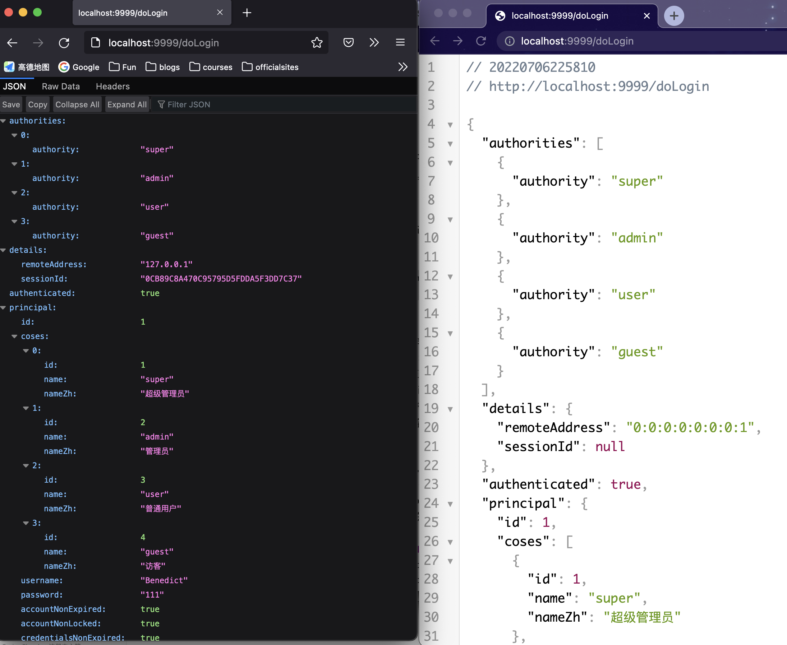
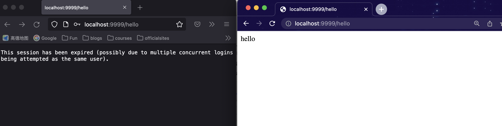
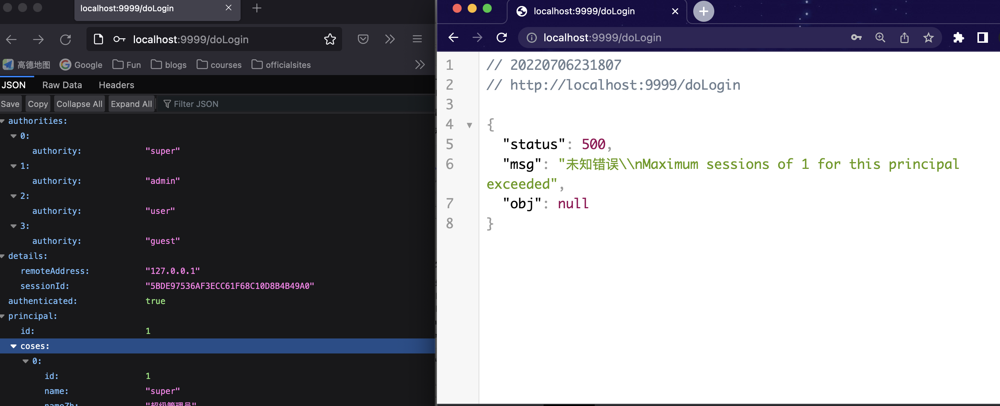
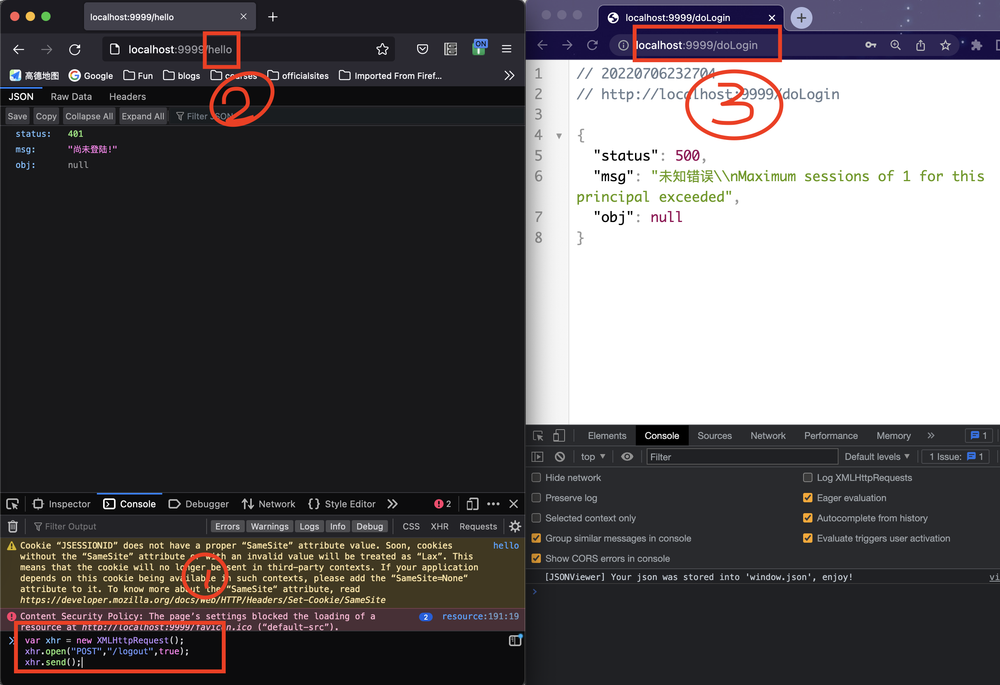
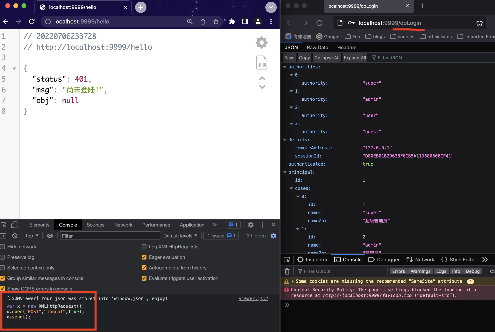

用过QQ的人应该都知道QQ客户端是禁止同一账号多PC登陆的。**[Spring Security]默认情况下是:** <span style="color:red">**允许同一用户多终端登陆的。**</span>
但是特殊情况下，也需要完成类似QQ这样的需求。本文就来讨论实现这一功能。
<!-- more -->
# 验证默认情况  
1. 为了简化验证， 将之前验证码相关的逻辑去掉
```java
    //@Autowired
    //MyWebAuthenticationDetailsSource myWebAuthenticationDetailsSource;

    //.authenticationDetailsSource(myWebAuthenticationDetailsSource)
```
```html
<!--    <div class="input">-->
<!--        <input type="text" name="code" id="vCode">-->
<!--        <label for="rememberMe">验证码:</label>-->
<!--    </div>-->
```

2. 然后准备两个浏览器`Chrome` 和 `Firefox`. 
3. 启动项目， 用`Benedict` 账号登陆 `Chrome` 
4. 然后用同一个账号登陆Firefox
5. 分别在两个浏览器访问接口hello 发现都能正常响应。说明我们之前的猜想是正确的。

# 需求分析
在同一个系统中，我们可能只允许一个用户在一个终端上登录，一般来说这可能是出于安全方面的考虑，但是也有一些情况是出于业务上的考虑。比如: 有些付费app， 普通用户只能登陆一个设备，需要VIP用户才能一个用户多终端同时在线。


要实现一个用户不可以同时在两台设备上登录，我们有两种思路：
1. 后来的登录自动踢掉前面的登录，就像大家在扣扣中看到的效果。
2. 如果用户已经登录，则不允许后来者登录。
这种思路都能实现这个功能，具体使用哪一个，还要看我们具体的需求。 在 Spring Security 中，这两种都很好实现，一个配置就可以搞定。
# 方案1 踢前一用户下线
## 配置
这一方案的配置需要在`SecurityConfig#configure(httpsession)`设置最大session值为1。即:
```java
.and()
.sessionManagement()
.maximumSessions(1)
```
重启项目验证， 发现还是可以同一用户在两个PC登陆。

## TODO解释原因：为什么此时还可以同一用户在两个PC登陆。
为了解决这一问题，还需要添加如下配置，在原来`Client`里重写`hashcode和equals`方法。
```java
 @Override
    public int hashCode() {
        return Objects.hashCode(username);
    }
    
@Override
public boolean equals(Object obj) {
    if (this == obj) return true;
    if(obj == null || getClass() != obj.getClass()) return false;
    return Objects.equals(this.getUsername(),((Client) obj).getUsername());
}
```
## 测试

Chrome 上登录成功后，访问 /hello 接口。
Firefox 上登录成功后，访问 /hello 接口。
在 Chrome 上再次访问 /hello 接口，此时会看到如下提示：
`**This session has been expired (possibly due to multiple concurrent logins being attempted as the same user).**`



# 方案2 禁止第二个用户登陆
## 配置
在上面的基础上添加 maxSessionsPreventsLogin(true) 即表示禁止用户再次登陆。
```java
.and()
.sessionManagement()
.maximumSessions(1)
.maxSessionsPreventsLogin(true)
```
虽然这个已经可以， 但是有一个小问题。
因为在 Spring Security 中，它是通过监听 session 的销毁事件，来及时的清理 session 的记录。用户从不同的浏览器登录后，都会有对应的 session，当用户注销登录之后，session 就会失效，但是默认的失效是通过调用 StandardSession#invalidate 方法来实现的，这一个失效事件无法被 Spring 容器感知到，进而导致当用户注销登录之后，Spring Security 没有及时清理会话信息表，以为用户还在线，进而导致用户无法重新登录进来（小伙伴们可以自行尝试不添加上面的 Bean，然后让用户注销登录之后再重新登录）。
所以为了解决这个问题还需要向容器中添加一个
```java
@Bean
HttpSessionEventPublisher httpSessionEventPublisher() {
    return new HttpSessionEventPublisher();
}
```
## 测试
方案二的测试需要测试两个。
测试a: 确实后来的用户无法登陆。
报错如下：


测试b: 用户`logout`后`session` 没有立刻失效
1. chrome 登陆
2. Chrome访问hello
3. Chrome登出
4. Chrome验证已经登出
5. firefox访问login.html点击登陆后跳转返回如下报错：`aximum sessions of 1 for this principal exceeded`. 说明Chrome登出的session
没有立刻失效。

测试c: 注册`bean：HttpSessionEventPublisher` 用户`logout`后`session` 没有立刻失效
添加了`bean：HttpSessionEventPublisher`之后， 再次进行上面b里的测试。发现最后一步：
 
# 原理

我们知道，在用户登录的过程中，会经过 UsernamePasswordAuthenticationFilter，而 UsernamePasswordAuthenticationFilter 中过滤方法的调用是在 AbstractAuthenticationProcessingFilter 中触发的，我们来看下 AbstractAuthenticationProcessingFilter#doFilter 方法的调用：
```java
public void doFilter(ServletRequest req, ServletResponse res, FilterChain chain)
		throws IOException, ServletException {
	HttpServletRequest request = (HttpServletRequest) req;
	HttpServletResponse response = (HttpServletResponse) res;
	if (!requiresAuthentication(request, response)) {
		chain.doFilter(request, response);
		return;
	}
	Authentication authResult;
	try {
		authResult = attemptAuthentication(request, response);
		if (authResult == null) {
			return;
		}
		sessionStrategy.onAuthentication(authResult, request, response);
	}
	catch (InternalAuthenticationServiceException failed) {
		unsuccessfulAuthentication(request, response, failed);
		return;
	}
	catch (AuthenticationException failed) {
		unsuccessfulAuthentication(request, response, failed);
		return;
	}
	// Authentication success
	if (continueChainBeforeSuccessfulAuthentication) {
		chain.doFilter(request, response);
	}
	successfulAuthentication(request, response, chain, authResult);
```
在这段代码中，我们可以看到，调用 attemptAuthentication 方法走完认证流程之后，回来之后，接下来就是调用 sessionStrategy.onAuthentication 方法，这个方法就是用来处理 session 的并发问题的。具体在：
```java
public class ConcurrentSessionControlAuthenticationStrategy implements
		MessageSourceAware, SessionAuthenticationStrategy {
	public void onAuthentication(Authentication authentication,
			HttpServletRequest request, HttpServletResponse response) {

		final List<SessionInformation> sessions = sessionRegistry.getAllSessions(
				authentication.getPrincipal(), false);

		int sessionCount = sessions.size();
		int allowedSessions = getMaximumSessionsForThisUser(authentication);

		if (sessionCount < allowedSessions) {
			// They haven't got too many login sessions running at present
			return;
		}

		if (allowedSessions == -1) {
			// We permit unlimited logins
			return;
		}

		if (sessionCount == allowedSessions) {
			HttpSession session = request.getSession(false);

			if (session != null) {
				// Only permit it though if this request is associated with one of the
				// already registered sessions
				for (SessionInformation si : sessions) {
					if (si.getSessionId().equals(session.getId())) {
						return;
					}
				}
			}
			// If the session is null, a new one will be created by the parent class,
			// exceeding the allowed number
		}

		allowableSessionsExceeded(sessions, allowedSessions, sessionRegistry);
	}
	protected void allowableSessionsExceeded(List<SessionInformation> sessions,
			int allowableSessions, SessionRegistry registry)
			throws SessionAuthenticationException {
		if (exceptionIfMaximumExceeded || (sessions == null)) {
			throw new SessionAuthenticationException(messages.getMessage(
					"ConcurrentSessionControlAuthenticationStrategy.exceededAllowed",
					new Object[] {allowableSessions},
					"Maximum sessions of {0} for this principal exceeded"));
		}

		// Determine least recently used sessions, and mark them for invalidation
		sessions.sort(Comparator.comparing(SessionInformation::getLastRequest));
		int maximumSessionsExceededBy = sessions.size() - allowableSessions + 1;
		List<SessionInformation> sessionsToBeExpired = sessions.subList(0, maximumSessionsExceededBy);
		for (SessionInformation session: sessionsToBeExpired) {
			session.expireNow();
		}
	}
}
```
这段核心代码主要逻辑：
1. 首先调用 sessionRegistry.getAllSessions 方法获取当前用户的所有 session，该方法在调用时，传递两个参数，一个是当前用户的 authentication，另一个参数 false 表示不包含已经过期的 session（在用户登录成功后，会将用户的 sessionid 存起来，其中 key 是用户的主体（principal），value 则是该主题对应的 sessionid 组成的一个集合）。 
2. 接下来计算出当前用户已经有几个有效 session 了，同时获取允许的 session 并发数。 
3. 如果当前 session 数（sessionCount）小于 session 并发数（allowedSessions），则不做任何处理；如果 allowedSessions 的值为 -1，表示对 session 数量不做任何限制。 
4. 如果当前 session 数（sessionCount）等于 session 并发数（allowedSessions），那就先看看当前 session 是否不为 null，并且已经存在于 sessions 中了，如果已经存在了，那都是自家人，不做任何处理；如果当前 session 为 null，那么意味着将有一个新的 session 被创建出来，届时当前 session 数（sessionCount）就会超过 session 并发数（allowedSessions）。 
5. 如果前面的代码中都没能 return 掉，那么将进入策略判断方法 allowableSessionsExceeded 中。 
6. allowableSessionsExceeded 方法中，首先会有 exceptionIfMaximumExceeded 属性，这就是我们在 SecurityConfig 中配置的 maxSessionsPreventsLogin 的值，默认为 false，如果为 true，就直接抛出异常，那么这次登录就失败了（对应 2.2 小节的效果），如果为 false，则对 sessions 按照请求时间进行排序，然后再使多余的 session 过期即可（对应 踢掉之前登陆用户的效果）。