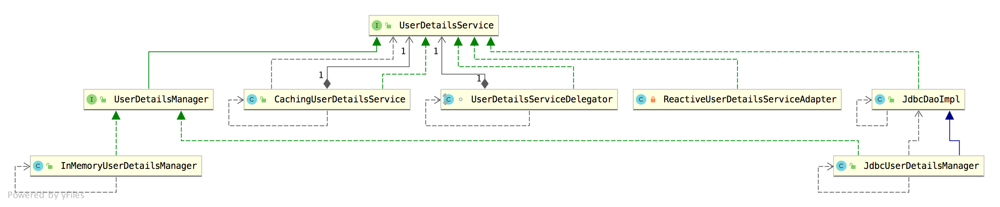
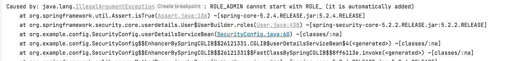
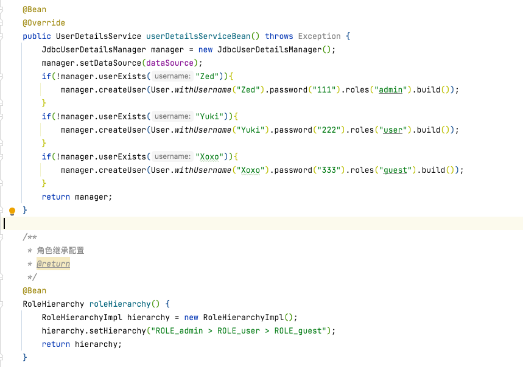
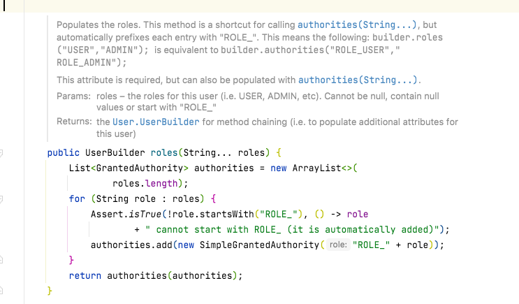
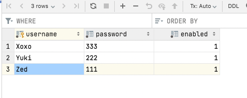
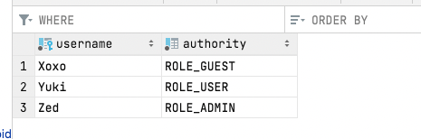

之前的章节中, Spring Security 使用的用户数据都是内存中的。 但是项目中，大部分情况下都是自己设计权限数据库
不过，Spring Security 也给我们提供了一个它自己设计好的权限数据库，这里我们先来看看这是怎么回事！先来学这个简单的，然后我们再去看复杂的。


UserDetailService
Spring Security 支持多种不同的数据源，这些不同的数据源最终都将被封装成 UserDetailsService 的实例，
既可以自己封装实现UserDetailsService接口的类，也可以使用系统默认提供的 UserDetailsService 实例，例如之前文章中介绍的 InMemoryUserDetailsManager。
为了弄清楚具体的原理， 先看看UserDetailsService的继承关系。


2.JdbcUserDetailsManager
JdbcUserDetailsManager 自己提供了一个数据库模型，这个数据库模型保存在如下位置：
`org/springframework/security/core/userdetails/jdbc/users.ddl`

```sql
create table users
(
    username varchar_ignorecase(50) not null primary key,
    password varchar_ignorecase(500) not null,
    enabled boolean not null
);
create table authorities
(
    username varchar_ignorecase(50) not null,
    authority varchar_ignorecase(50) not null,
    constraint fk_authorities_users foreign key (username) references users (username)
);
create unique index ix_auth_username on authorities (username, authority);
```
由于Spring Security底层建表使用的DB引擎是HSQL， 所以想要在本地MySQL建立与上面一样的表和索引需要对语法进行替换，然后在本地建库建表，如下
```mysql
# 建库
create database if not exists springsecurity;
use springsecurity;
# 建表
create table users
(
    username varchar(50) not null primary key,
    password varchar(500) not null,
    enabled boolean not null
);
create table authorities
(
    username varchar(50) not null,
    authority varchar(50) not null,
    constraint fk_authorities_users foreign key (username) references users (username)
);
create unique index ix_auth_username on authorities (username, authority);
```
执行完 SQL 脚本后，我们可以看到一共创建了两张表：users 和 authorities。

users 表中保存用户的基本信息，包括用户名、用户密码以及账户是否可用。
authorities 中保存了用户的角色。
authorities 和 users 通过 username 关联起来。
配置完成后，接下来，我们将上篇文章中通过 InMemoryUserDetailsManager 提供的用户数据用 JdbcUserDetailsManager 代替掉，如下：
```java
//    @Bean
//    protected UserDetailsService userDetailsService() {
//        InMemoryUserDetailsManager manager = new InMemoryUserDetailsManager();
//        manager.createUser(User.withUsername("Alex").password("123").roles("admin").build());
//        manager.createUser(User.withUsername("Brooks").password("456").roles("user").build());
//        return manager;
//    }

    @Autowired
    DataSource dataSource;

    @Bean
    @Override
    public UserDetailsService userDetailsServiceBean() throws Exception {
        JdbcUserDetailsManager manager = new JdbcUserDetailsManager();
        manager.setDataSource(dataSource); //关联数据源
        if(!manager.userExists("Zed")){
        manager.createUser(User.withUsername("Zed").password("111").roles("ADMIN").build());
        }
        if(!manager.userExists("Yuki")){
        manager.createUser(User.withUsername("Yuki").password("222").roles("USER").build());
        }
        if(!manager.userExists("Xoxo")){
        manager.createUser(User.withUsername("Xoxo").password("333").roles("GUEST").build());
        }
        return manager;
    }
```
这段配置的含义如下：

1. 首先构建一个 JdbcUserDetailsManager 实例。
2. 给 JdbcUserDetailsManager 实例添加一个 DataSource 对象。
3. 调用 userExists 方法判断用户是否存在，如果不存在，就创建一个新的用户出来（因为每次项目启动时这段代码都会执行，所以加一个判断，避免重复创建用户）。
4. 用户的创建方法和我们之前 InMemoryUserDetailsManager 中的创建方法基本一致。
这里的 createUser 或者 userExists 方法其实都是调用写好的 SQL 去判断的，我们从它的源码里就能看出来（部分）：

```java
public class JdbcUserDetailsManager extends JdbcDaoImpl implements UserDetailsManager,
		GroupManager {
	public static final String DEF_USER_EXISTS_SQL = "select username from users where username = ?";

	private String userExistsSql = DEF_USER_EXISTS_SQL;

	public boolean userExists(String username) {
		List<String> users = getJdbcTemplate().queryForList(userExistsSql,
				new String[] { username }, String.class);

		if (users.size() > 1) {
			throw new IncorrectResultSizeDataAccessException(
					"More than one user found with name '" + username + "'", 1);
		}

		return users.size() == 1;
	}
}
```

注意⚠️ 
1. 因为要与数据库交互, 不要忘记注入DataSource对象。
```java
    @Autowired
    DataSource dataSource;
```
2. 角色前面不要加ROLE_ 否则会报错  


3. 角色名称大小写敏感而且要与原来角色继承配置里的配置保持一致。否则也会报错。



4. 当然要也要记得在configure(HttpSecurity http)里加上 `.antMatchers("/guest/**").hasRole("guest")`


查看源码发现是已经为其添加了ROLE_前缀了
````java
public UserBuilder roles(String... roles) {
    List<GrantedAuthority> authorities = new ArrayList<>(
            roles.length);
    for (String role : roles) {
        Assert.isTrue(!role.startsWith("ROLE_"), () -> role
        + " cannot start with ROLE_ (it is automatically added)");
        authorities.add(new SimpleGrantedAuthority("ROLE_" + role));
    }
    return authorities(authorities);}
````


3. 添加pom依赖和修改yml
```xml
<dependency>
    <groupId>org.springframework.boot</groupId>
    <artifactId>spring-boot-starter-jdbc</artifactId>
</dependency>
<dependency>
    <groupId>mysql</groupId>
    <artifactId>mysql-connector-java</artifactId>
</dependency>
```

```yaml
server:
  port: 9999
spring:
  security:
    user:
      name: Joshua
      password: 123
      roles: admin
  datasource:
    url: jdbc:mysql://localhost:3306/springsecurity?useUnicode=true&serverTimezone=Asia/Shanghai&characterEncoding=utf-8&zeroDateTimeBehavior=convertToNull&useSSL=false
    username: root
    password:
    driver-class-name: com.mysql.cj.jdbc.Driver
```

测试
启动项目， 发现后台已经插入了上面三个用户的信息了。



